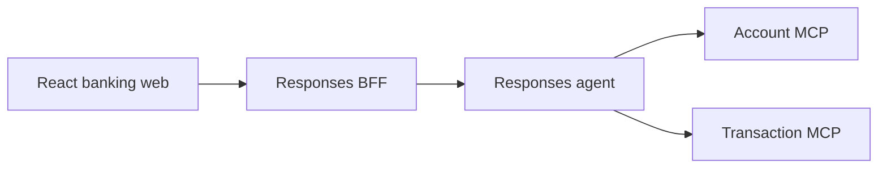

# Repository Guide

This repository is a banking-assistant prototype built with Python, Microsoft Agent Framework, Foundry Responses, FastMCP, React, and Terraform.

## Active Architecture



- `app/backend`: Account/Transaction handoff workflow and Responses host.
- `app/responses-bff`: application JWT boundary and Responses proxy.
- `app/business-api/account`: Account REST and MCP service.
- `app/business-api/transaction`: Transaction REST and MCP service.
- `app/frontend/banking-web`: React/Vite banking UI and Responses stream client.
- `infra`: Terraform for the App Service stack and Foundry resources.
- `app/backend/azure.yaml`: separate azd root for the hosted Foundry agent.

Payment remains under `app/business-api/payment` and in the root infrastructure for compatibility, but it is not part of the active agent workflow. Do not reconnect it, modify that service as part of agent work, or reintroduce ChatKit and attachment uploads.

## Security Boundaries

- The browser calls the BFF and never calls Foundry or the local agent directly.
- The BFF authenticates environment-configured Argon2 users, issues short-lived application JWTs, validates those JWTs, and obtains Azure credentials server-side.
- Conversation ownership is bound to the verified JWT subject.
- The BFF signs verified `sub` and `customer_id` claims for the agent. The agent verifies that envelope and issues a fresh 60-second bearer for Account and Transaction MCP calls. This chain is validated locally; hosted transport behavior still requires proof.
- Account and Transaction enforce customer-resource ownership in `services.py` over the current dummy ownership maps. Preserve these checks when replacing dictionaries with PostgreSQL repositories.
- PostgreSQL-backed users, persisted ownership relationships, and dynamic per-request profile/locale injection are not implemented. Do not add fixed tokens, `MOCK_SESSION_TOKEN`, fabricated claims, or a second login mechanism.
- Never log JWTs, passwords, bearer tokens, or Azure credentials.

## Local Development

The root `.vscode` configuration owns local orchestration. `DEV - Full Stack Ordered` starts:

| Port   | Process               |
| ------ | --------------------- |
| `5170` | Banking web           |
| `8080` | Responses BFF         |
| `8088` | Local Responses agent |
| `8070` | Account MCP           |
| `8071` | Transaction MCP       |

Use the browser through this topology for local validation. Hosted Foundry deployment is a later, separate validation target.

## Development Rules

- Read `plan/README.md` and `plan/00-decisions.md` before non-trivial changes.
- Keep `plan/` local-only and never stage or commit it.
- Use Python 3.11+, modern type annotations, async I/O, and `uv`.
- Keep MCP tools thin; put business logic and authorization in service modules.
- Keep agent instructions and tool schemas in English. The JWT already carries `locale`, but final-response locale injection remains pending until the context provider uses the verified per-request claim.
- Preserve the separate root App Service and `app/backend` hosted-agent azd projects.

## Focused Checks

```powershell
cd app/backend
uv run pytest tests/test_hosted_workflow.py tests/test_settings.py -q

cd ../responses-bff
uv run pytest -q

cd ../frontend/banking-web
npm run lint
npm run build
```

Run `terraform fmt -check -recursive` and `terraform validate` from `infra` after infrastructure changes.
