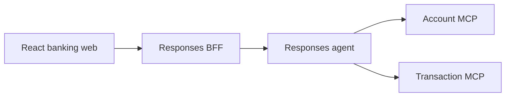

# Repository Guide

This repository is a banking-assistant prototype built with Python, Microsoft Agent Framework, Foundry Responses, FastMCP, React, and Terraform.

## Active Architecture



- `app/agent`: Account/Transaction handoff workflow and Responses host.
- `app/responses-bff`: application JWT boundary and Responses proxy.
- `app/business-api/account`: Account REST and MCP service.
- `app/business-api/transaction`: Transaction REST and MCP service.
- `app/business-api/data`: SQLModel/Alembic schema and verified CSV-to-PostgreSQL pipeline.
- `app/frontend/banking-web`: React/Vite banking UI and Responses stream client.
- `infra`: Terraform for the App Service stack and Foundry resources.
- `app/agent/azure.yaml`: separate azd root for the hosted Foundry agent.

Payment remains under `app/business-api/payment` and in the root infrastructure for compatibility, but it is not part of the active agent workflow. Do not reconnect it, modify that service as part of agent work, or reintroduce ChatKit and attachment uploads.

## Security Boundaries

- The browser calls the BFF and never calls Foundry or the local agent directly.
- The BFF authenticates PostgreSQL-backed Argon2 users, issues short-lived application JWTs, validates those JWTs, and obtains Azure credentials server-side. Its [service guide](app/responses-bff/README.md) documents login, profile, and owned-account reads.
- Conversation ownership is bound to the verified JWT subject.
- The BFF signs verified `sub` and `customer_id` claims for the agent. The agent verifies that envelope and issues a fresh 60-second bearer for Account and Transaction MCP calls. This chain is validated locally; hosted transport behavior still requires proof.
- Account and Transaction enforce customer-resource ownership in `services.py` through PostgreSQL product relationships and transaction filters. Preserve these checks when changing repositories.
- Persisted users, customer names, owned-account selection and signed profile/locale injection are implemented. Actual multilingual conversations and hosted identity transport validation remain pending. Do not add fixed tokens, `MOCK_SESSION_TOKEN`, fabricated claims, or a second login mechanism.
- Never log JWTs, passwords, bearer tokens, or Azure credentials.

## Local Development

The root `.vscode` configuration owns local orchestration. `DEV - Full Stack Ordered` starts:

| Port   | Process               |
| ------ | --------------------- |
| `5170` | Banking web           |
| `8080` | Responses BFF         |
| `8088` | Local Responses agent |
| `8070` | Account MCP           |
| `8071` | Transaction MCP       |

Use the browser through this topology for local validation. Hosted Foundry deployment is a later, separate validation target.

## Data Ingestion

Use `app/business-api/data/scripts/run_pipeline.py` for normal data loads. It runs EDA,
scope selection, loading, and verification in order. The
[data module guide](app/business-api/data/README.md) is the source of truth for detailed
operation. Invoke it from the repository root with the data project's ignored `.env` file
and an explicit inclusive date window:

```powershell
uv run --project app/business-api/data --env-file app/business-api/data/.env python app/business-api/data/scripts/run_pipeline.py --start-date 2026-06-01 --end-date 2026-06-01 --customer-ids CUSTOMER_A,CUSTOMER_B,CUSTOMER_C
```

- `--customer-ids` is optional and is one comma-separated string. Whitespace and duplicates
  are normalized internally; demo loads should use at most three customers.
- Customer filtering applies to `customers`, `products`, and transactions in the selected
  date window. `branches` and `service_agents` remain complete shared catalogs.
- The loader validates requested customers and product ownership before committing selected
  transactions. It never populates `users`.
- Dimensions commit first. Each transaction day then commits or rolls back independently,
  and later days continue after a failed day.
- Treat the generated load manifest as the source of truth for checksums, processed counts,
  customer scope, daily outcomes, and verification. Filtered artifact names include a stable
  customer count/hash suffix.
- Keep `DATABASE_URL`, `DATA_SOURCE_DIR`, `DATA_ARTIFACTS_DIR`, and `DATA_MANIFEST_DIR` in the
  ignored data `.env`; never print credentials.

## Development Rules

- Read `plan/README.md` and `plan/00-decisions.md` before non-trivial changes.
- Keep `plan/` local-only and never stage or commit it.
- Use Python 3.11+, modern type annotations, async I/O, and `uv`.
- Keep MCP tools thin; put business logic and authorization in service modules.
- Keep agent instructions and tool schemas in English. The profile provider uses signed per-request `locale` (`es`, `pt`, `en`, otherwise `en`) for response language. Do not infer it from messages or checkpoint state.
- Preserve the separate root App Service and `app/agent` hosted-agent azd projects.

## Focused Checks

```powershell
cd app/agent
uv run pytest tests/test_hosted_workflow.py tests/test_settings.py -q

cd ../responses-bff
uv run pytest -q

cd ../frontend/banking-web
npm run lint
npm run build

cd ../../business-api/data
uv run pytest tests/test_run_pipeline.py -q
```

Run `terraform fmt -check -recursive` and `terraform validate` from `infra` after infrastructure changes.
