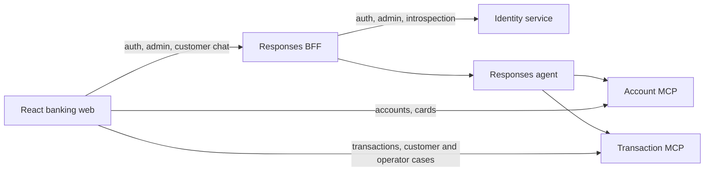

# Repository Guide

This repository is a banking-assistant prototype built with Python, Microsoft Agent Framework, Foundry Responses, FastMCP, React, and Terraform.

Read [Copilot Instructions](.github/copilot-instructions.md) before repository work.
That file owns all repository-wide agent rules; this guide is an entry point, not a
second policy set. Use [ARCHITECTURE.md](ARCHITECTURE.md) for the code map and
[docs/adr/README.md](docs/adr/README.md) for decision rationale.

## Active Architecture



- [app/agent](app/agent): Account/Transaction handoff workflow and Responses host.
- [app/business-api/identity](app/business-api/identity): credentials, profiles,
  identity lifecycle, JWT issuance and administrator operations.
- [app/responses-bff](app/responses-bff): database-free browser boundary for Identity
  facades and customer Responses chat.
- [app/business-api/account](app/business-api/account): account/card REST reads and
  Account MCP tools.
- [app/business-api/transaction](app/business-api/transaction): transaction REST/MCP
  reads, customer disputes and operator queue, claim and adjudication APIs.
- [app/business-api/shared/src/banking_shared](app/business-api/shared/src/banking_shared):
  canonical SQLModel persistence tables and database wiring.
- [app/business-api/data](app/business-api/data): Alembic migrations, historical
  archives and CSV-to-PostgreSQL pipeline.
- [app/frontend/banking-web](app/frontend/banking-web): React/Vite UI for customer
  banking, support cases, administrator pages and operator queue/detail pages.
  `/operator` redirects to `/operator/support-cases`.
- [infra](infra): Terraform for the App Service stack and Foundry resources.
- [app/agent/azure.yaml](app/agent/azure.yaml): separate azd root for the hosted agent.

This is an implementation map, not evidence of deployed or live-data acceptance.

## Python Package Convention

Python projects install their application packages from `src/` through their own
`pyproject.toml` and uv environment. Keep meaningful responsibility-based subpackages
such as `models`, `routers`, `services`, `auth`, `projections`, and domain helpers;
do not flatten them into `src/<package>` or create generic catch-all modules.
The Agent follows the same convention under `app/agent/src/app`.

Use package-qualified imports and stable module/console entrypoints. Do not repair
imports with runtime `sys.path` changes or `PYTHONPATH`. Checkout scripts may remain
thin CLI adapters, with implementation inside the installed package. See the
[package map](ARCHITECTURE.md) and [service structure](app/business-api/README.md#-service-structure)
for current namespaces and responsibilities.

## Local Development

The root `.vscode` configuration owns local orchestration. `DEV - Full Stack Ordered` starts:

| Port   | Process               |
| ------ | --------------------- |
| `5170` | Banking web           |
| `8080` | Responses BFF         |
| `8088` | Local Responses agent |
| `8070` | Account MCP           |
| `8071` | Transaction MCP       |
| `8090` | Identity              |

F5 starts all six services in separate terminals through root
[launch.json](.vscode/launch.json) and [tasks.json](.vscode/tasks.json).
Each service has its own `.env` and `.env.example`. See the component guides below
for configuration and Copilot Instructions for operational restrictions.

## Task Guides

| Task                                       | Source of truth                                                                                                    |
| ------------------------------------------ | ------------------------------------------------------------------------------------------------------------------ |
| Architecture and security constraints      | [Copilot Instructions](.github/copilot-instructions.md#locked-architecture-do-not-relitigate-without-new-evidence) |
| Data ingestion and manifest verification   | [Data module guide](app/business-api/data/README.md)                                                               |
| Replay and held-out evaluation             | [Evaluation guide](evals/README.md)                                                                                |
| Evaluation policy and verified CI evidence | [Evaluation requirements](.github/copilot-instructions.md#evaluation-requirements)                                 |
| Identity, bootstrap and administrator APIs | [Identity guide](app/business-api/identity/README.md)                                                              |
| BFF identity facades and Responses proxy   | [BFF guide](app/responses-bff/README.md)                                                                           |
| Infrastructure                             | [Infrastructure guide](infra/README.md)                                                                            |

## Focused Checks

Run from repository root; select the commands for the changed component. These are
local checks, not a replacement for the full CI workflow.

```powershell
$env:OTEL_SDK_DISABLED = "true"
rtk proxy uv run --directory app\agent python -m pytest tests -q
rtk proxy uv run --directory app\responses-bff python -m pytest tests -q
rtk proxy uv run --directory app\business-api\identity python -m pytest tests -q
rtk proxy uv run --directory app\business-api\account python -m pytest tests -q
rtk proxy uv run --directory app\business-api\transaction python -m pytest tests -q
rtk proxy uv run --directory app\business-api\data python -m pytest tests -q
rtk proxy uv run --project evals --extra offline python -m pytest evals\tests -q

rtk proxy npm --prefix app\frontend\banking-web run test
rtk proxy npm --prefix app\frontend\banking-web run lint
rtk proxy npm --prefix app\frontend\banking-web run build

rtk proxy terraform -chdir=infra fmt -check -recursive
rtk proxy terraform -chdir=infra validate
```

For ingestion-only edits, narrow the data test selector to
`tests\test_run_pipeline.py`; it is not the full data suite. Terraform validation
requires an initialized working directory; see the infrastructure guide.

CI-specific commands and prerequisites live in:

- [Python CI action](.github/actions/ci-python/action.yml): frozen dependency sync,
  syntax compilation, pytest and deployment-requirements verification.
- [Node CI action](.github/actions/ci-node/action.yml): clean dependency installation,
  lint, Vitest coverage and build. The frontend currently has no `typecheck` script.
- [Hosted Agent CI](.github/workflows/ci-hosted-agent.yml) and the
  [offline comparator guide](evals/README.md#offline-comparator-and-scoring): offline
  evaluation tests, fresh deterministic baseline and rescoring. Real-model replay
  is a separate opt-in check, not part of the default commands above.
