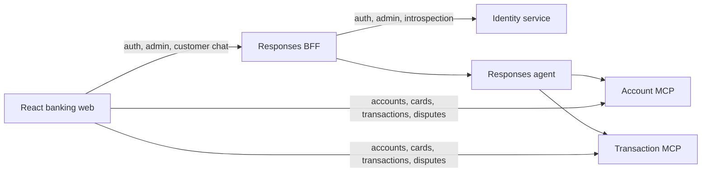

# Repository Guide

This repository is a banking-assistant prototype built with Python, Microsoft Agent Framework, Foundry Responses, FastMCP, React, and Terraform.

Read [Copilot Instructions](.github/copilot-instructions.md) before repository work.
That file owns all repository-wide agent rules; this guide is an entry point, not a
second policy set. Use [ARCHITECTURE.md](ARCHITECTURE.md) for the code map and
[docs/adr/README.md](docs/adr/README.md) for decision rationale.

## Active Architecture



- `app/agent`: Account/Transaction handoff workflow and Responses host.
- `app/business-api/identity`: persisted credentials, profiles, fixed roles, lifecycle,
  JWT issuance, audited administrator operations and explicit bootstrap.
- `app/responses-bff`: database-free browser boundary for allowlisted Identity facades
  and customer Responses chat. It checks current identity through introspection;
  it does not verify passwords or read banking data.
- `app/business-api/account`: Account REST and MCP service. Its REST endpoints verify the
  browser's application JWT directly (`jwt_identity.py`); its MCP tools verify a separate
  short-lived agent-only bearer (`internal_identity.py`).
- `app/business-api/transaction`: Transaction REST and MCP service, same dual-auth split
  as Account.
- `app/business-api/data`: SQLModel/Alembic schema and verified CSV-to-PostgreSQL pipeline.
- `app/frontend/banking-web`: React/Vite banking UI, calling Account/Transaction directly
  for financial data and the Responses stream through the BFF for chat. Includes the
  transaction-dispute support-case pages (`/support-cases`, `/support-cases/:caseId`,
  `ReportDisputeDialog`), calling Transaction's `/api/support-cases` directly with the
  same application JWT, never through the BFF. Administrator pages use
  `/admin/operators`, `/admin/operators/create` and `/admin/customers`, with shared
  customer UI components and centered action-confirmation modals. `/operator`
  remains a placeholder; real reviewer queues and decisions are not enabled.
- `infra`: Terraform for the App Service stack and Foundry resources.
- `app/agent/azure.yaml`: separate azd root for the hosted Foundry agent.

## Local Development

The root `.vscode` configuration owns local orchestration. `DEV - Full Stack Ordered` starts:

| Port   | Process               |
| ------ | --------------------- |
| `5170` | Banking web           |
| `8080` | Responses BFF         |
| `8088` | Local Responses agent |
| `8070` | Account MCP           |
| `8071` | Transaction MCP       |
| `8090` | Identity              |

F5 starts all six services in separate terminals. Each service owns its ignored
`.env` and documented `.env.example`; there is no root dotenv configuration.
Frontend authentication and administration use the BFF URL, not a direct Identity URL.
Use this topology for user-run browser validation; do not start it implicitly.
Hosted Identity deployment and Foundry validation remain separate rollout gates.

## Task Guides

| Task                                       | Source of truth                                                                                                    |
| ------------------------------------------ | ------------------------------------------------------------------------------------------------------------------ |
| Architecture and security constraints      | [Copilot Instructions](.github/copilot-instructions.md#locked-architecture-do-not-relitigate-without-new-evidence) |
| Data ingestion and manifest verification   | [Data module guide](app/business-api/data/README.md)                                                               |
| Replay and held-out evaluation             | [Evaluation guide](evals/README.md)                                                                                |
| Evaluation policy and verified CI evidence | [Evaluation requirements](.github/copilot-instructions.md#evaluation-requirements)                                 |
| Identity, bootstrap and administrator APIs | [Identity guide](app/business-api/identity/README.md)                                                              |
| BFF identity facades and Responses proxy   | [BFF guide](app/responses-bff/README.md)                                                                           |
| Infrastructure                             | [Infrastructure guide](infra/README.md)                                                                            |

## Focused Checks

```powershell
cd app/agent
$env:PYTHONPATH = (Resolve-Path ../..).Path
$env:OTEL_SDK_DISABLED = "true"
uv run python -m pytest tests -q

cd ../responses-bff
uv run pytest -q

cd ../business-api/identity
uv run pytest tests -q

cd ../account
uv run --directory . python -m pytest tests -q

cd ../transaction
uv run --directory . python -m pytest tests -q

cd ../../frontend/banking-web
npm run lint
npm run build

cd ../../business-api/data
uv run pytest tests/test_run_pipeline.py -q
```

Run `terraform fmt -check -recursive` and `terraform validate` from `infra` after infrastructure changes.
