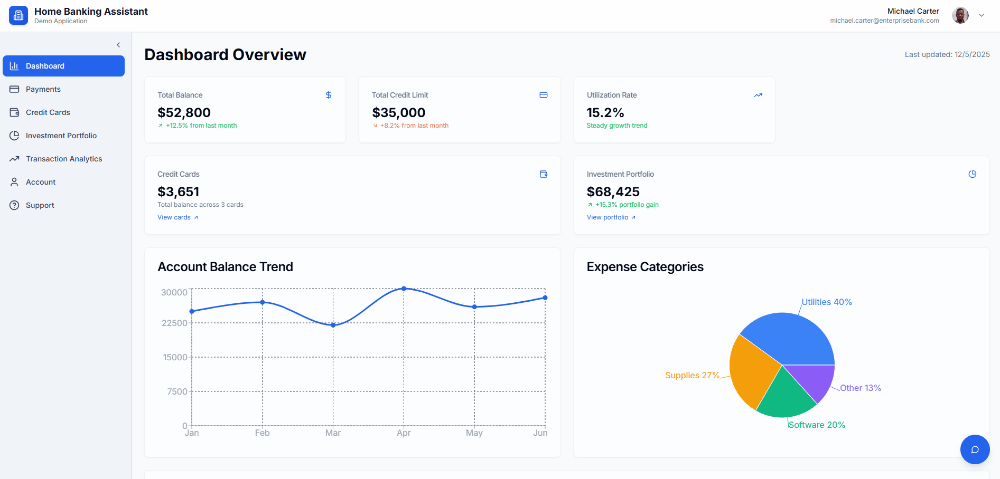
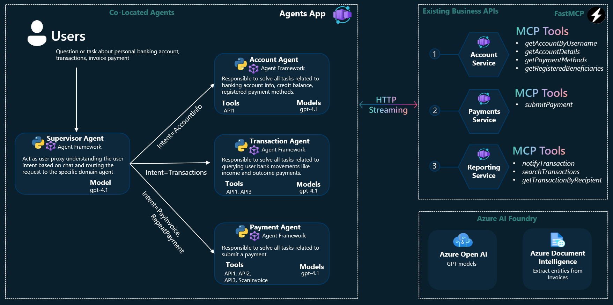

<!-- YAML front-matter schema: https://review.learn.microsoft.com/en-us/help/contribute/samples/process/onboarding?branch=main#supported-metadata-fields-for-readmemd -->
<!-- prettier-ignore -->
<div align="center">


</div>

# Multi Agent Banking Assistant

This hackathon prototype extends Microsoft's public [Azure-Samples/agent-openai-python-banking-assistant](https://github.com/Azure-Samples/agent-openai-python-banking-assistant) sample. The current workflow focuses on Account and Transaction inquiries through Foundry Responses. Data persistence, dynamic localization, hosted validation, and evaluation work are tracked in [the prototype plan](./plan/README.md).

For the 2026-10-05 submission, the target audience is retail banking customers who need fast support resolution and clear balance-movement explanations. Dataset profiling shows higher monthly activity in 2026 than 2025 for selected customers, but the core value proposition remains workflow clarity, approval control, and end-to-end case traceability rather than high-volume optimization alone. The demo scope includes one contextual product recommendation after case resolution, with strict guardrails (single recommendation, rationale shown, and opt-out support) to avoid spam-like behavior.

A banking personal assistant designed to revolutionize the way users interact with their bank account information, transaction history, and payment functionalities. Utilizing the power of generative AI within a multi-agent architecture, this assistant aims to provide a seamless, conversational interface through which users can effortlessly access and manage their financial data.

Even if specific to banking scenarios, this sample can be used for other business use cases as technical reference architecture concerning customer support chatbots or virtual assistants using Microsoft Agent Framework to implement supervisor based orchestration for multiple domains agents that need to integrate with business domains API through MCP. AI-powered assistants in other domains by adapting the agents tools and backend services to your specific business needs.

<div align="center">
  
[**BUSINESS SCENARIO**](#business-scenario)  \| [**SOLUTION OVERVIEW**](#solution-overview)  \| [**QUICK DEPLOY**](#quick-deploy)  \| [**SUPPORTING DOCUMENTATION**](#supporting-documentation)

</div>
<br/>

**Note:** With any AI solutions you create using these templates, you are responsible for assessing all associated risks and for complying with all applicable laws and safety standards. Learn more in the transparency documents for [Agent Service](https://learn.microsoft.com/en-us/azure/ai-foundry/responsible-ai/agents/transparency-note) and [Agent Framework](https://github.com/microsoft/agent-framework/blob/main/TRANSPARENCY_FAQ.md).
<br/>

<h2>
Business scenario
</h2>

<div align="center">  

</div>
<br/>

Users can converse with the assistant to inquire about account balances and review recent transactions instead of navigating traditional menus. The active workflow does not execute payments.

The submission MVP extends this flow into support operations: users can open a support case from conversation context, track status progression, complete at least one meaningful approval step, and receive a contextual product recommendation only after case resolution.

The Account and Transaction APIs read banking data from PostgreSQL through a shared SQLModel package and enforce ownership in their service layer. The Payment service and invoice samples remain as inherited artifacts but are not connected to the agent. The [Responses BFF](./app/responses-bff/README.md) authenticates persisted users with Argon2, returns customer names, and fronts the Responses agent; the frontend calls Account and Transaction directly, with the same application JWT, for account, card, and transaction reads.

### Key Features

<details open>
  <summary>Click to learn more about the key features this solution enables</summary>
 
 - **Add an agentic conversational experience to your existing website** <br/>
The React frontend streams OpenAI Responses events for account and transaction inquiries through a JWT-protected BFF.
 - **Multi-agent supervisor architecture** <br/>
 Use handoff orchestration to understand user intent and delegate requests to domain agents. The hosted-agent manifest declares **gpt-4.1-mini** on [Microsoft Foundry](https://azure.microsoft.com/en-us/products/ai-foundry); this repository does not provision the model deployment.
 - **Reusing existing business APIs as MCP tools** <br/>
 Business service logic is exposed to agents through MCP using [fastmcp](https://gofastmcp.com/getting-started/welcome) 
 - **Microsoft Agent Framework First** <br/>
 Use [MAF](https://learn.microsoft.com/en-us/agent-framework/overview/agent-framework-overview) chat agents to flexibly support AzureOpenAI or Foundry Agent Service based agents
 - **Human-In-The-Loop (HITL) patterns** <br/>
 Generic approval events can be presented by the Responses client without coupling the UI to payment-specific behavior.
- **Separate hosted agent and App Services** <br/>
The Foundry hosted agent uses its own azd project; the root Terraform stack defines five App Services for the BFF, web frontend, and business APIs.
- **Automated IaC and App build & Deployment**
Automated Azure resources creation and solution deployment leveraging [Azure Developer CLI](https://learn.microsoft.com/en-us/azure/developer/azure-developer-cli/).

</details>
<br/>

<h2>
Solution overview
</h2>

### Solution architecture

|  |
| --------------------------------------------- |

The home banking assistant uses a handoff workflow whose agents specialize in account and transaction inquiries. Business service logic is exposed to those agents through MCP endpoints. The browser sends OpenAI Responses requests with a bearer JWT to the BFF. The BFF validates the user, signs downstream identity, and routes the request to the local Responses agent or, when configured, obtains an Azure access token and calls the Foundry-hosted agent.

### Additional resources

- [Skilling-Presentation](./docs/Home%20Banking%20Assistant.pdf)
- [Technical Architecture](./docs/technical-architecture.md)
- [Historical ChatKit protocol reference](./docs/chat-server-protocol.md)
- For Semantic Kernel version check this [branch](https://github.com/Azure-Samples/agent-openai-python-banking-assistant/tree/semantic-kernel)

<br /><br />

<h2>
Quick Deploy 
</h2>

| [](https://codespaces.new/Azure-Samples/agent-openai-python-banking-assistant) | [](https://vscode.dev/redirect?url=vscode://ms-vscode-remote.remote-containers/cloneInVolume?url=https://github.com/Azure-Samples/agent-openai-python-banking-assistant) |
| --------------------------------------------------------------------------------------------------------------------------------------------------- | ---------------------------------------------------------------------------------------------------------------------------------------------------------------------------------------------------------------------------------------------------------------------------------------------------------------------------- |

<br/>

### Prerequisites

- [Python >= 3.11](https://www.python.org/downloads/release/python-31113/)
- [uv](https://github.com/astral-sh/uv)
- [Azure Developer CLI](https://aka.ms/azure-dev/install)
- [Node.js](https://nodejs.org/en/download/)
- [Git](https://git-scm.com/downloads)
- [Powershell 7+ (pwsh)](https://github.com/powershell/powershell) - For Windows users only.
  - **Important**: Ensure you can run `pwsh.exe` from a PowerShell command. If this fails, you likely need to upgrade PowerShell.

> [!WARNING]
> Your Azure Account must have `Microsoft.Authorization/roleAssignments/write` permissions, such as [User Access Administrator](https://learn.microsoft.com/azure/role-based-access-control/built-in-roles#user-access-administrator) or [Owner](https://learn.microsoft.com/azure/role-based-access-control/built-in-roles#owner).

Clone this repository and select an azd environment. Before provisioning the root stack, prepare an existing resource group and Terraform remote-state storage as described in [Terraform provisioning](./infra/README.md). Import existing resources and review the Terraform plan before provisioning a previously deployed environment.

### Deploy targets in this repository

This repository intentionally uses two separate Azure Developer CLI project roots:

- Root project (`./azure.yaml`): Terraform provisions the shared Linux plan, five App Services, monitoring, Blob storage, and a dedicated Foundry account and project; root `azd deploy` deploys only the App Service workloads.
- Agent project (`./app/agent/azure.yaml`): the `microsoft.foundry` provider deploys the hosted agent to the existing Foundry project. Set its `FOUNDRY_PROJECT_ENDPOINT` from the root environment output before deploying; the two azd environments are separate.

Naming note for the App Service stack: the frontend app uses `app-banking-web-<env>` (for example, `app-banking-web-development`) so the web workload name is explicit and distinct from backend services.

Use these commands from the repository root:

```shell
# Provision the App Service and dedicated Foundry resources after remote state setup and plan review
azd provision
azd deploy

# Configure and deploy the separate hosted-agent project after local agent validation
# azd env set FOUNDRY_PROJECT_ENDPOINT <root FOUNDRY_PROJECT_ENDPOINT> --cwd app/agent
azd up --cwd app/agent
```

For iterative agent updates only:

```shell
azd deploy --cwd app/agent
```

### Python dependency artifact for App Service zip deploy

The three Python MCP APIs (`account`, `transaction`, `payment`) and the Responses BFF are deployed independently from the root `azure.yaml`. For App Service zip deploy, each Python service directory must include its own `requirements.txt` so Oryx can install runtime dependencies. Keep `pyproject.toml` and the `uv` lock files as the development source of truth and regenerate `requirements.txt` before deployment changes.

```shell
uv pip compile app/business-api/account/pyproject.toml --no-emit-package banking-shared -o app/business-api/account/requirements.txt
uv pip compile app/business-api/transaction/pyproject.toml --no-emit-package banking-shared -o app/business-api/transaction/requirements.txt
uv pip compile app/business-api/payment/pyproject.toml -o app/business-api/payment/requirements.txt
uv export --project app/responses-bff --no-dev --no-hashes --no-emit-project --no-emit-package banking-shared --output-file app/responses-bff/requirements.txt
```

Account, Transaction, and the BFF consume the canonical SQLModel package from `app/business-api/shared` during development. Their `azd` prepackage hooks copy that importable package into each isolated App Service zip, and postpackage hooks remove the temporary copies. The `--no-emit-package` option keeps machine-local editable paths out of the Oryx dependency artifact.

Foundry Responses maintains conversation history when requests link turns with a signed user-bound `conversation` value. The BFF rejects conversation identifiers that belong to a different authenticated user. It verifies PostgreSQL-backed Argon2 identities and issues short-lived HS256 JWTs.

The local Responses host creates an independent workflow per request and restores the
matching conversation checkpoint when present. The installed hosting SDK persists
local checkpoints as JSON under `~/.agentserver/state_stores`, unless
`AGENTSERVER_STATE_ROOT` overrides the root. Browser threads exist only in React state:
a reload clears the thread, and its first message creates a new user-bound conversation.

For more info about deployment click [here](./docs/deployment-guide.md)

🛠️ **Need Help?** Check our [Troubleshooting Guide](./docs/troubleshooting.md) for solutions to common deployment issues.
<br/><br/>

### Prerequisites and costs

Pricing varies per region and usage, so it isn't possible to predict exact costs for your usage.
However, you can try the [Azure pricing calculator](https://azure.com/e/8ffbe5b1919c4c72aed89b022294df76) for the resources below.

- Azure App Service: a shared Linux B1 plan for the five apps. [Pricing](https://azure.microsoft.com/en-us/pricing/details/app-service/linux/)
- Azure Blob Storage: Standard LRS. [Pricing](https://azure.microsoft.com/pricing/details/storage/blobs/)
- Azure Monitor: Log Analytics and Application Insights, billed by usage. [Pricing](https://azure.microsoft.com/en-us/pricing/details/monitor/)
- The separate Foundry project and model usage have their own costs.

Do not run `azd down` against an existing shared resource group as a rollback strategy; review the Terraform plan and resource ownership first.

### Local development (VS Code)

Start the Account MCP service (8070), Transaction MCP service (8071), local Responses agent (8088), Responses BFF (8080), and Vite frontend (5170). The BFF uses `RESPONSES_UPSTREAM_MODE=local`, so browser requests never call Foundry directly during local validation. Account and Transaction verify the browser's application JWT directly for their REST endpoints; set a shared `JWT_SECRET_KEY` alongside `DATABASE_URL` in the ignored root `.env.dev` so all three services agree on it.

In VS Code, press `F5` with `DEV - Full Stack Ordered` to start all five services and open the frontend at `http://localhost:5170/`. The frontend task waits for Vite to report that URL; port `5170` must be available for this launch configuration. Set `DATABASE_URL` in the ignored root `.env.dev` so Account, Transaction, and the BFF use the seeded PostgreSQL database.

The BFF exposes the protected Responses endpoint at `http://localhost:8080/responses`; the local agent listens at `http://localhost:8088/responses`.

For local Azure OpenAI inference with `PROFILE=dev`, sign in with `az login` using an identity that has the `Cognitive Services OpenAI User` role on the configured Azure AI Services resource. Create approved persisted test identities through the [demo user seeder](./app/business-api/data/README.md#seed-demo-users) and sign in through the frontend. Do not substitute a fixed development bearer token.

<h2>
Supporting documentation
</h2>

### Restrict access to the public web app

The root Terraform stack does not configure network access restrictions for the public web app. Prototype JWT authentication and persisted ownership checks exist, but do not expose real customer data until hosted identity transport, deployment controls, and the complete authorization validation matrix are verified.

### Prototype limitations

This repository is a hackathon prototype. It demonstrates an architecture pattern and deployment topology, but it does not claim production-ready controls for a regulated banking environment.

Current limitations to keep explicit:

- End-user login uses PostgreSQL-backed Argon2 identities and short-lived JWTs; it is not a production identity lifecycle.
- The frontend displays persisted customer names and owned accounts, including explicit multi-account selection. Account codes absent from the schema are omitted; Agreements and Privacy & Security Policy remain inherited placeholders.
- Dashboard and Analytics consume Account and Transaction directly over JWT-authenticated REST, with fully paginated transactions. Credit/debit cards use a customer-scoped, read-only catalog with server-masked numbers; card operations remain unavailable. See the [frontend guide](app/frontend/banking-web/README.md) for presentation and validation limits.
- Account and Transaction use persisted product ownership and transaction rows. Selected local two-user PostgreSQL and browser financial comparisons passed, but the complete signed agent-chain, browser-state, and deployed validation matrices remain open.
- Signed stored-locale context and profile-bound frontend i18n support exact `es`, `pt`, and `en`, with English fallback. Static JSON catalogs translate UI and transaction labels; controlled BFF failures use localized UI messages, while login stays English. Product queries use canonical English labels and ingestion normalizes Spanish source values. Automated coverage does not establish authenticated browser localization, multilingual agent conversations, or hosted parity. See the [localization guide](app/frontend/banking-web/README.md#localization).
- On 2026-09-30, user-supplied local browser evidence confirmed an owned-account answer with full bank number and masked card output, and a foreign-account lookup returning `ACCESS_DENIED` followed by a visible assistant response. This closes the reported blank-response failure, not the full authorization or hosted matrix. See the [verification checklist](DEMO_SCOPE_CHECKLIST.md#0-real-data-verification-gate-next).
- MCP and internal API authorization must be enforced in service code (`customer_id` ownership checks), not inferred from prompts.
- The frontend must not call Foundry or agent endpoints directly; browser traffic for the chat path must go through the Responses BFF. Account and Transaction reads are the one scoped exception: the frontend calls those two services directly, authenticated with the same application JWT the BFF issues.
- The BFF validates application identity and proxies upstream requests, but this does not replace per-resource authorization in business services.
- The previous ChatKit-style direct browser-to-agent pattern is no longer the target architecture.
- HITL approval widgets are generic protocol support; approval policy still requires business-specific hardening and audit coverage.
- Prompt-injection resilience is bounded by deterministic authorization checks and does not rely on model instruction following alone.
- Logging and tracing are useful for diagnostics, but sensitive-data controls and retention governance must be reviewed before production.

Production controls that remain outside this prototype scope:

- Enterprise IAM integration (full account lifecycle, MFA, password reset, session revocation, key rotation).
- End-to-end network isolation (private endpoints, restricted ingress, and explicit east-west trust boundaries).
- Complete compliance controls (PCI-DSS, GDPR, local banking regulation mapping, evidence collection, and formal audit workflows).
- Fraud and abuse controls (risk scoring, anomaly detection, velocity rules, and adaptive step-up authentication).
- Operational resilience standards (disaster recovery objectives, multi-region failover, and formal incident response playbooks).
- Full security verification program (penetration testing, dependency governance, SAST/DAST tuning, and continuous control validation).

In short: the intended secure pattern is `frontend -> BFF -> hosted agent -> authenticated MCP/APIs`, with authorization checks in each business service. The prototype already aligns to that direction, and remaining phases close the gaps.

### Security guidelines

> [!IMPORTANT]
> **This sample is a proof-of-concept. Its prototype authentication and authorization controls are not production-ready.**

The sample does not cover the following aspects, essential to the security of the solution:

- **Prototype identity lifecycle**: The BFF verifies PostgreSQL-backed Argon2 users and issues short-lived JWTs. Registration, password reset, MFA, and revocation are not implemented.
- **Local identity chain only**: Signed BFF-to-agent identity and 60-second agent-to-MCP bearers are validated locally. Hosted delegated-identity transport remains unverified.
- **Persisted ownership checks**: Account and Transaction service methods enforce `customer_id` ownership through PostgreSQL product relationships and transaction-row filters. Hosted transport and full browser scenario validation remain pending.
- **Conversation binding is application-scoped**: The BFF binds conversation identifiers to verified JWT subjects, but production persistence, lifecycle, and hosted isolation still require validation.

When deploying to production with real customer data, consider implementing:

- **End-user authentication and authorization integrated with your identity provider**
- **Conversation and data isolation per user and per account**
- **Audit logging of all access and operations**
- **Compliance with applicable regulations (PCI-DSS, GDPR, local banking regulations)**

### Resources

Here are some resources to learn more about multi-agent architectures and technologies used in this sample:

- [Microsoft Agent Framework](https://github.com/microsoft/agent-framework)
- [AI agents For Beginners](https://github.com/microsoft/ai-agents-for-beginners)
- [Azure AI Foundry](https://learn.microsoft.com/en-us/azure/ai-foundry/what-is-azure-ai-foundry)
- [Develop AI apps using Azure services](https://aka.ms/azai)
- [Building Effective Agents - Anthropic](https://www.anthropic.com/engineering/building-effective-agents)
- [AI agent orchestration patterns](https://learn.microsoft.com/en-us/azure/architecture/ai-ml/guide/ai-agent-design-patterns)

You can also find [more Microsoft Foundry agents samples here](https://aka.ms/aiapps)

## Getting Help

If you get stuck or have any questions about building AI apps, join:

[](https://aka.ms/foundry/discord)

If you have product feedback or errors while building visit:

[](https://aka.ms/foundry/forum)

## Troubleshooting

If you have any issue when running or deploying this sample [open an issue](https://https://github.com/Azure-Samples/agent-openai-python-banking-assistant/issues) in this repository.

## Contributing

This project welcomes contributions and suggestions. Most contributions require you to agree to a
Contributor License Agreement (CLA) declaring that you have the right to, and actually do, grant us
the rights to use your contribution. For details, visit https://cla.opensource.microsoft.com.

When you submit a pull request, a CLA bot will automatically determine whether you need to provide
a CLA and decorate the PR appropriately (e.g., status check, comment). Simply follow the instructions
provided by the bot. You will only need to do this once across all repos using our CLA.

This project has adopted the [Microsoft Open Source Code of Conduct](https://opensource.microsoft.com/codeofconduct/).
For more information see the [Code of Conduct FAQ](https://opensource.microsoft.com/codeofconduct/faq/) or
contact [opencode@microsoft.com](mailto:opencode@microsoft.com) with any additional questions or comments.

## Trademarks

This project may contain trademarks or logos for projects, products, or services. Authorized use of Microsoft
trademarks or logos is subject to and must follow
[Microsoft's Trademark & Brand Guidelines](https://www.microsoft.com/en-us/legal/intellectualproperty/trademarks/usage/general).
Use of Microsoft trademarks or logos in modified versions of this project must not cause confusion or imply Microsoft sponsorship.
Any use of third-party trademarks or logos are subject to those third-party's policies.

## Responsible AI Transparency

This AI multi-agent Banking Assistant template is provided ‘as-is’ and ‘without warranty’ under the MIT license. Any AI solutions developed or deployed using these types of agentic templates require that you and your organization carefully evaluate all relevant requirements and risks, and ensure compliance with applicable laws, guidelines, and safety standards. Caution is strongly advised when utilizing this template—particularly in [sensitive domains](https://learn.microsoft.com/en-us/azure/ai-foundry/responsible-ai/agents/transparency-note?view=foundry-classic#disclaimer-about-agents-in-sensitive-domains)—to develop autonomous agentic AI actions that may be irreversible. For further details, please consult the transparency documents for [Agent Service](https://learn.microsoft.com/en-us/azure/ai-foundry/responsible-ai/agents/transparency-note?view=foundry-classic) and [Agent Framework](https://github.com/microsoft/agent-framework/blob/main/TRANSPARENCY_FAQ.md).”

## Disclaimers

To the extent that the Software includes components or code used in or derived from Microsoft products or services, including without limitation Microsoft Azure Services (collectively, “Microsoft Products and Services”), you must also comply with the Product Terms applicable to such Microsoft Products and Services. You acknowledge and agree that the license governing the Software does not grant you a license or other right to use Microsoft Products and Services. Nothing in the license or this ReadMe file will serve to supersede, amend, terminate or modify any terms in the Product Terms for any Microsoft Products and Services.

You must also comply with all domestic and international export laws and regulations that apply to the Software, which include restrictions on destinations, end users, and end use. For further information on export restrictions, visit https://aka.ms/exporting.

You acknowledge that the Software and Microsoft Products and Services (1) are not designed, intended or made available as a medical device(s), and (2) are not designed or intended to be a substitute for professional medical advice, diagnosis, treatment, or judgment and should not be used to replace or as a substitute for professional medical advice, diagnosis, treatment, or judgment. Customer is solely responsible for displaying and/or obtaining appropriate consents, warnings, disclaimers, and acknowledgements to end users of Customer’s implementation of the Online Services.

You acknowledge the Software is not subject to SOC 1 and SOC 2 compliance audits. No Microsoft technology, nor any of its component technologies, including the Software, is intended or made available as a substitute for the professional advice, opinion, or judgement of a certified financial services professional. Do not use the Software to replace, substitute, or provide professional financial advice or judgment.

BY ACCESSING OR USING THE SOFTWARE, YOU ACKNOWLEDGE THAT THE SOFTWARE IS NOT DESIGNED OR INTENDED TO SUPPORT ANY USE IN WHICH A SERVICE INTERRUPTION, DEFECT, ERROR, OR OTHER FAILURE OF THE SOFTWARE COULD RESULT IN THE DEATH OR SERIOUS BODILY INJURY OF ANY PERSON OR IN PHYSICAL OR ENVIRONMENTAL DAMAGE (COLLECTIVELY, “HIGH-RISK USE”), AND THAT YOU WILL ENSURE THAT, IN THE EVENT OF ANY INTERRUPTION, DEFECT, ERROR, OR OTHER FAILURE OF THE SOFTWARE, THE SAFETY OF PEOPLE, PROPERTY, AND THE ENVIRONMENT ARE NOT REDUCED BELOW A LEVEL THAT IS REASONABLY, APPROPRIATE, AND LEGAL, WHETHER IN GENERAL OR IN A SPECIFIC INDUSTRY. BY ACCESSING THE SOFTWARE, YOU FURTHER ACKNOWLEDGE THAT YOUR HIGH-RISK USE OF THE SOFTWARE IS AT YOUR OWN RISK.
