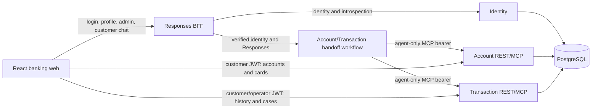

# Banking Assistant: Grounded Inquiries and Transaction Disputes

An AI-first banking customer-service prototype for the **Factored AI & Data
Hackathon 2026**, extending Microsoft's public
[banking assistant sample](https://github.com/Azure-Samples/agent-openai-python-banking-assistant).
It focuses on one workflow: explain owned accounts and transactions, obtain explicit
consent for a card-transaction dispute, and hand the case to an accountable human
operator. Banking inputs are synthetic dataset records persisted in PostgreSQL,
not live bank or payment-processor data.

[Workflow](#customer-and-operator-workflow) · [Architecture](#architecture) ·
[Challenge alignment](#factored-challenge-alignment) · [Run locally](#run-locally) ·
[Guides](#documentation-map)

## Problem and scope

An unfamiliar transaction requires more than an answer: the customer needs the
correct transaction context, control over initiating a dispute, and an auditable
path to review and resolution. This prototype connects conversational assistance
with the same ownership-checked services used by the banking UI.

The model handles natural-language intake, domain handoffs and explanations.
Deterministic services enforce authentication, ownership, eligibility, consent,
review routing and recorded effects. A model-generated answer never grants
permission, decides dispute legitimacy or proves financial settlement. Scope is
intentionally limited to Account/Transaction inquiries and one dispute case layer;
there is no payment agent, invoice upload, lending decision or autonomous verdict.

## Customer and operator workflow

1. **Inspect:** the customer signs in and browses owned accounts/cards or asks the
   assistant about balances and transactions. The product catalog and detail page
   provide scoped, paginated history and filters; retired Analytics/Cards/Investments
   routes redirect to the catalog.
2. **Clarify or stop:** an ambiguous transaction needs clarification. Foreign or
   missing resources do not disclose another customer's data; unsupported operations
   return an explicit unavailable outcome rather than fabricated results.
3. **Consent:** chat or a transaction-row action produces an owned, read-only dispute
   proposal. Preview and decline create no case/events. Acceptance atomically records
   intake, consent and routing in `IN_REVIEW`. Cases accepted through the UI continue
   in chat by readback, without recreation or second consent. Legacy pending cases
   retain their approval path.
4. **Review:** stored synthetic `fraud_score` routes review; low, high and missing
   scores never establish legitimacy or automatically resolve a case. A real operator
   claims a case exclusively and submits a reasoned, versioned verdict.
5. **Record the outcome:** invalid cases become `RESOLVED_INVALID`. Valid cases stay
   `PENDING_EFFECTS` until compensation posting and runtime balance effects succeed,
   then become `RESOLVED_VALID`. Debit allocation uses eligible owned same-currency
   savings/checking accounts; credit compensation reduces card debt. Card protection
   is separately audited application state, not external processor enforcement.
   A single post-resolution recommendation supports explicit opt-out.

Customer case list/detail/timeline pages and the operator queue/detail workspace
expose persisted progress. Administrator pages manage fixed-role operator identities
and customer lifecycle; staff cannot use customer chat or customer financial endpoints.
See the [Transaction contract](app/business-api/transaction/README.md),
[frontend guide](app/frontend/banking-web/README.md) and
[recorded-effects decision](docs/adr/0009-operator-verdicts-with-recorded-financial-effects.md)
for routes, recovery, concurrency and policy details.

## Architecture

- **Identity:** persisted Argon2 credentials, fixed customer/operator/admin roles,
  short-lived HS256 JWTs, lifecycle and identity-version revocation.
- **BFF:** database-free Identity facade and customer Responses stream proxy.
  Consumers check current identity on each protected request and fail closed on
  Identity unavailability. Application JWTs and fresh agent-to-MCP bearers are separate.
- **Agent:** Microsoft Agent Framework `HandoffBuilder` with triage, Account and
  Transaction specialists. Disputes are a service workflow, not another specialist.
  The [hosted manifest](app/agent/azure.yaml) declares `model-router` and `gpt-5.4`
  deployments. Per-agent deployment settings select models, with a shared fallback;
  declarations do not establish available cloud capacity.
- **Persistence/deployment:** shared SQLModel tables and a reproducible CSV pipeline.
  Root Terraform defines five App Services (Identity, Account, Transaction, BFF,
  web), PostgreSQL, Key Vault, Blob storage, monitoring and Foundry resources.
  Every App Service uses an explicit name binding; the hosted agent has a separate
  azd project.

The [architecture map](ARCHITECTURE.md) explains where changes belong;
[ADRs](docs/adr/README.md) document the decisions and tradeoffs.

## Factored challenge alignment

The [published challenge and evaluation dimensions](https://www.factored.ai/careers/ai-data-hackathon#Submission-requirements)
prioritize a focused banking workflow, justified AI usage, secure tools, human
oversight and explicit autonomy/accuracy/latency/cost tradeoffs. The table separates
implementation from evidence still needed; it is not a claim of production readiness.

| Dimension          | Current contribution and detail guide                                                                                                                                         | Evidence boundary / remaining work                                                                                                                                 |
| ------------------ | ----------------------------------------------------------------------------------------------------------------------------------------------------------------------------- | ------------------------------------------------------------------------------------------------------------------------------------------------------------------ |
| Technical Judgment | Separate Identity/BFF/REST/MCP boundaries; deterministic consent, ownership, operator verdicts and effects. [ADRs](docs/adr/README.md)                                        | Full negative-path, hosted identity, reliability and rollback acceptance remain open.                                                                              |
| AI Engineering     | Streaming React-to-BFF-to-Responses integration and Account/Transaction handoffs. [Agent guide](app/agent/README.md)                                                          | Real-model protocol smoke is verified; semantic grounding and multilingual workflow quality require broader evidence.                                              |
| Data Engineering   | Approved cohort/date-window ingestion, normalization, dimension upserts, independent daily transactions and checksum manifests. [Data guide](app/business-api/data/README.md) | Persisted synthetic data is not live banking data; complete runtime field/service parity remains a separate gate.                                                  |
| Machine Learning   | Deterministic comparator, synthetic replay/scoring, held-out scenario definitions and offline fraud-threshold analysis. [Evaluation guide](evals/README.md)                   | No newly trained fraud model or paired real-model improvement is claimed; stored synthetic scores are inputs, not discovered fraud.                                |
| Data Analytics     | Customer-scoped product history, filters, currency-aware totals and labeled reconstructed snapshots. [Frontend guide](app/frontend/banking-web/README.md)                     | Transaction activity does not establish support demand or savings; measured safe-resolution impact, latency, cost and segment/language comparisons remain pending. |

## Evaluation and observed evidence

- **Automated service tests:** seeded fixtures exercise ownership, consent, routing,
  operator verdicts, posting and duplicate-compensation protection. Historical
  isolated localhost PostgreSQL checks cover concurrency/rollback; complete runtime
  acceptance remains a separate gate.
- **Selected local observations:** owner-confirmed customer/operator positive E2E
  flows and selected two-user financial comparisons are recorded. These do not close
  all error/retry, session-isolation, locale, data-parity or hosted matrices.
- **Verified CI protocol and structured replay checks:**
  [CI run 37264970360](https://github.com/cristofima/factored-hackathon-2026-cristopher-coronado/actions/runs/37264970360)
  passed Hosted Agent build/tests, real-model MCP protocol smoke with Azure login and
  evidence artifacts, and **offline Dispute Replay** alignment, comparator and
  rescoring checks. Offline dispute checks are not real-model dispute evaluation;
  this run does not establish semantic quality, human verdicts, recorded financial
  effects, live authorization or hosted end-to-end acceptance.
- **Semantic evaluation implementation and local checks:** eight synthetic en/es/pt
  cases separate confidentiality, helpfulness, injection resistance, groundedness,
  relevance and locale. Credential-free deterministic checks and opt-in model
  capture/judging are implemented. On 2026-10-05, all **187 evaluation tests passed**
  in the Agent environment (Python 3.14.4), and the authored technical fixture passed
  **8/8 traces with zero model calls**. See the [evaluation guide](evals/README.md#observed-local-validation)
  and [test guide](evals/tests/README.md) for commands and coverage. Mocked judgments
  and fixture success do not establish real-model quality; the rubric remains
  uncalibrated, and remote semantic execution/CI acceptance remain unverified.
- **Guardrails and locale limitations:** shared agent instructions reject credential
  disclosure, hidden-prompt extraction and instruction overrides.
  SDK-marked refusals are localized in offline tests, but browser ordinary-text
  refusals still arrive in English and further debugging is deferred. See the
  [agent guide](app/agent/README.md#grounding-and-confidentiality) and
  [evaluation boundaries](evals/README.md#evaluation-methods).
- **Evaluation workload boundaries:** the 25-case dispute replay is development-exposed
  synthetic confirmation, not untouched held-out evidence. The 18 held-out definitions
  are not observed proposed-system results. Current replay focuses on investigation,
  not the assigned-operator verdict/effects path; paired real-model comparison remains open.

No reduction in support workload, production cost, latency or unsafe outcomes is
claimed. Impact reporting must compare the same frozen workload, distinguish safe
resolution from containment/escalation, include failure denominators and p50/p95
latency, and report cost per attempt and per successful safe resolution. Language
and segment results need sample-size limitations. See the
[evaluation guide](evals/README.md) for commands, artifacts and remaining gates.

## Run locally

Prerequisites: Python 3.11+, uv, Node.js/npm, Git, an approved PostgreSQL environment
and configured model access. Running the
stack locally does not imply inference is offline or free.

1. Follow the [data setup and pipeline guide](app/business-api/data/README.md) for
   migrations and an approved explicit date/customer scope. Provision login identities
   separately using the [demo seeder](app/business-api/data/README.md#explicit-demo-identity-seeding);
   ingestion and startup never implicitly create users or bootstrap an administrator.
2. Install component dependencies and configure each service's ignored `.env` from
   its `.env.example`: [Identity](app/business-api/identity/README.md),
   [Account/Transaction](app/business-api/README.md), [agent](app/agent/README.md#local-setup),
   [BFF](app/responses-bff/README.md) and [web](app/frontend/banking-web/README.md).
   There is no root dotenv file; the BFF must not receive database credentials.
3. In VS Code, run **F5 → DEV - Full Stack Ordered**. Root
   [launch configuration](.vscode/launch.json) and [tasks](.vscode/tasks.json) start
   Identity (8090), Account (8070), Transaction (8071), agent (8088), BFF (8080),
   and web (5170). Sign in through the frontend; browser chat never bypasses the BFF.

Focused checks are listed in [AGENTS.md](AGENTS.md#focused-checks). Configuration,
bootstrap and pipeline details belong to the component guides, not this landing page.

## Deployment and operational limits

Use the [infrastructure guide](infra/README.md) and
[deployment guide](docs/deployment-guide.md) for the separate root App Service and
hosted-agent azd projects, existing-resource ownership and rollout gates. The
[workflow guide](.github/workflows/README.md) owns CI/CD configuration; the
[dependency-artifact guide](app/business-api/README.md#python-dependency-artifacts)
owns requirements regeneration and zip packaging.

- **Prototype, not regulated production:** network restrictions, MFA, refresh sessions,
  retention/deletion policy, fairness and complete operational acceptance are not
  established. Do not expose real customer data on the strength of fixtures or IaC.
- **Locale and explainability:** profile-driven `en`/`es`/`pt` UI and agent response
  support exists; English prompts/tool definitions and canonical codes stay unchanged.
  Explain recorded sources, policy and audit events, not hidden reasoning. Complete
  multilingual model/browser quality is unverified.
- **Consent and financial scope:** approval or claim is not settlement. Recorded
  compensation has one entitlement per source transaction across cases/retries;
  arbitrary payments, recharge/pay, investments, reversals, reassignment, review
  timeouts and retroactive compensation are outside the current scope.
- **Freshness:** new disputes use a 365-day eligibility window against the real clock.
  Check the dataset's latest transaction before a demo; recent synthetic test dates
  do not establish live eligibility. Changing the window or loading fresher data is
  an explicit business/demo decision.
- **Continuity:** temporary browser threads and signed completed-response tokens
  survive same-login reloads in tab-scoped session storage, but clear on logout/new
  login. Help also exposes owning-customer, read-only PostgreSQL case snapshots:
  bounded visible intake messages, not a complete durable chat archive or resumable
  checkpoint. Uncertain failed turns remain locked; safe retry is not implemented.
  Hosted identity transport and linked-turn acceptance remain separate gates.
- **Cost:** account for the shared five-site App Service plan, PostgreSQL, Key Vault,
  storage, monitoring and model usage. No measured operating-cost estimate is published.

## Documentation map

| Detail                                                | Source of truth                                                                                                     |
| ----------------------------------------------------- | ------------------------------------------------------------------------------------------------------------------- |
| Physical code map and design decisions                | [Architecture](ARCHITECTURE.md), [ADRs](docs/adr/README.md)                                                         |
| Agent setup, tools and conversation state             | [Agent](app/agent/README.md)                                                                                        |
| Browser trust boundary and Responses proxy            | [BFF](app/responses-bff/README.md)                                                                                  |
| Credentials, roles, lifecycle and administrator APIs  | [Identity](app/business-api/identity/README.md)                                                                     |
| Account/card inquiries                                | [Account](app/business-api/account/README.md)                                                                       |
| Transactions, consent, operators and recorded effects | [Transaction](app/business-api/transaction/README.md)                                                               |
| Shared REST/MCP integration and packaging             | [Business APIs](app/business-api/README.md)                                                                         |
| Ingestion, manifests, seeding and snapshots           | [Data](app/business-api/data/README.md)                                                                             |
| Screens, catalog and localization                     | [Frontend](app/frontend/banking-web/README.md)                                                                      |
| Evaluation commands, evidence and limitations         | [Evaluations](evals/README.md)                                                                                      |
| Provisioning, deployment and CI/CD                    | [Infrastructure](infra/README.md), [Deployment](docs/deployment-guide.md), [Workflows](.github/workflows/README.md) |

## Attribution

Based on [Azure-Samples/agent-openai-python-banking-assistant](https://github.com/Azure-Samples/agent-openai-python-banking-assistant).
This fork's Identity/BFF boundaries, PostgreSQL pipeline, dispute/operator workflow,
frontend and Terraform choices are described above and in the ADRs; mutable upstream
features are not used as a version-pinned comparison. See [LICENSE](LICENSE).
