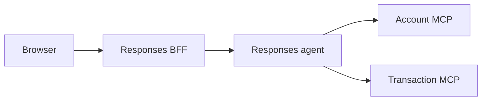

# Banking Assistant Responses Agent

This project hosts the Account and Transaction handoff workflow through the Foundry Responses protocol. It is a separate deployable from the browser-facing BFF under [`app/responses-bff`](../responses-bff).

## Runtime Flow



The browser never sends Azure credentials to Foundry. The BFF validates the application JWT and signs the verified `sub` and `customer_id` for this agent. The agent verifies that envelope and creates a fresh 60-second bearer for Account and Transaction MCP calls. In hosted mode, the BFF obtains its Azure token server-side before forwarding the request.

## Local Setup

Requirements:

- Python 3.11 or newer
- `uv`
- Azure OpenAI access configured in `.env.dev`
- Account MCP on port `8070`
- Transaction MCP on port `8071`

Install dependencies and run the local Responses host:

```powershell
cd app/agent
uv sync --extra dev
$env:PROFILE="dev"
uv run python -m app.main_responses_host
```

The agent listens on port `8088`. Browser traffic should go through the BFF on port `8080`, not directly to this process. The root `DEV - Full Stack Ordered` VS Code launch starts the supported local topology.

## Configuration

This directory is a separate `azd` project root because it has its own `azure.yaml` at `app/agent/azure.yaml`. The repository root `azure.yaml` (App Service stack) and this agent `azure.yaml` (hosted agent stack) do not share `azd` environment state automatically.

When you run commands with `--cwd app/agent` (or directly from this folder), `azd` may prompt for:

- An agent environment name
- Azure subscription
- Azure region/location

Using the same environment name as root is fine for consistency, but state is still independent per project root.

Configure the Foundry project endpoint and the name of a model deployment in that project:

```env
FOUNDRY_PROJECT_ENDPOINT=https://your-resource.services.ai.azure.com/api/projects/your-project
AZURE_AI_PROJECT_ID=/subscriptions/<subscription-id>/resourceGroups/<resource-group>/providers/Microsoft.CognitiveServices/accounts/<account-name>/projects/<project-name>
MODEL_DEPLOYMENT_NAME=gpt-4.1-mini
ACCOUNT_MCP_URL=http://localhost:8070/mcp
TRANSACTION_MCP_URL=http://localhost:8071/mcp
INTERNAL_IDENTITY_SECRET=<shared-secret-at-least-32-characters>
```

For hosted provisioning with `azd`, make sure the agent environment includes at least:

- `FOUNDRY_PROJECT_ENDPOINT`
- `AZURE_AI_PROJECT_ID`
- `MODEL_DEPLOYMENT_NAME`
- `ACCOUNT_MCP_URL`
- `TRANSACTION_MCP_URL`

Local execution reads both `.env` and `.env.dev` when `PROFILE=dev` and uses the developer's Azure credential. Keep common MCP URLs in `.env` and environment-specific Foundry values in `.env.dev` so later files do not silently replace shared values.

Hosted deployment is owned by [`azure.yaml`](azure.yaml) and uses managed identity. Foundry injects `FOUNDRY_PROJECT_ENDPOINT` into the hosted container; `MODEL_DEPLOYMENT_NAME=gpt-4.1-mini` is an application-defined declaration in the manifest. Neither manifest provisions the model deployment, and hosted deployment has not been verified by the local test suite.

## Validation

```powershell
uv run pytest tests/test_hosted_workflow.py tests/test_internal_identity.py tests/test_settings.py -q
```

The focused suite passed with 23 tests covering handoff completion, safe ownership
denials, signed identity, settings, and concurrent workflow-request isolation. SDK
deprecation warnings and a telemetry-exporter connection failure remain separate from
the passing test assertions.

On 2026-09-30, the user confirmed local browser success through the BFF: an owned
account returned details and masked cards; a foreign account reached
`getAccountDetails(product_number=...)`, returned `ACCESS_DENIED`, and produced a
visible assistant denial before `response.completed`. No foreign financial data was
returned. Missing/empty account cases, multi-turn checkpoint restoration, approval
continuation, and hosted identity transport remain unverified end to end.

## Conversation State

[The isolated host](app/helpers/isolated_responses_host.py) builds a fresh workflow
for each request. The hosting runtime restores the matching conversation checkpoint
inside that request before delivering new input; different requests do not share
mutable executor state. This uses an internal extension point of the installed
hosting SDK and must be revalidated when upgrading it.

The default checkpoint provider uses `FoundryStateStore`. Outside Foundry hosting,
the installed SDK writes JSON files under `~/.agentserver/state_stores`, or under
`AGENTSERVER_STATE_ROOT/state_stores` when configured. Execution state is in RAM,
but checkpoints can survive process restarts. They are not stored in PostgreSQL.
Treat these files as sensitive conversation data; a browser reload neither deletes
them nor resumes them automatically.
