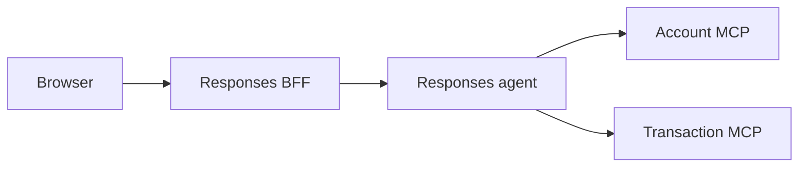

# Banking Assistant Responses Agent

This project hosts the Account and Transaction handoff workflow through the Foundry Responses protocol. It is a separate deployable from the browser-facing BFF under [`app/responses-bff`](../responses-bff).

Transaction disputes are the workflow's persisted support-case use case, not a
third specialist. The agent identifies the transaction, gathers the customer's
reason, requests explicit approval, and explains tool-reported outcomes. The
Transaction service owns policy, triage, ownership checks, and case events; the
agent never determines dispute legitimacy or invents a missing fraud score.

Existing-case consultations are read-only. Triage routes case lists, status,
timelines, and follow-ups to Transaction. Ambiguous references require customer
selection; status follow-ups refresh case details and event questions fetch the
timeline. Missing and foreign cases are described equivalently as unavailable.
Customer consent and `IN_REVIEW` do not establish operator takeover or a verdict.
Manual-created cases use the same persisted follow-up tools; creating one does not
invoke a background model.

Discovery accepts merchant, approximate date, amount and masked-card clues, with
explicit selection among at most five readable tool-backed candidates. Full verified
product numbers remain necessary where the existing lookup contract requires them;
masked digits and database IDs are not lookup keys. Latest-movement lookup covers
only five movements, and MCP tools have no date/pagination arguments. No match is
reported within that limited searched scope, not as proof of exhaustive history.
Incorrect-amount complaints preserve the expected amount in the reason under the
existing full-original-amount policy, never a promised partial refund.

## Pre-intake consent and localized context

Selected-charge confirmation is separate from explicit case consent. The Transaction
agent first calls `previewTransactionDispute` with the selected transaction and reason.
The preview is read-only and contains no persisted case or case ID. Explicit consent
to create the case and request review is required before `reportTransactionDispute`
accepts the signed preview token. Decline creates no case or event; unclear or unrelated
affirmation requires clarification. Acceptance records intake, consent and routing
atomically in `IN_REVIEW`, without a second review-consent step.

The shared frontend proposal displays tool-backed amount/currency, date, masked card,
merchant and optional owned country/city. Proposal tokens stay in transport, never
assistant prose. Acceptance lasts ten minutes; read-only `recoverTransactionDispute`
recovery lasts 24 hours from issuance. Ambiguous failures require recovery, not blind
resubmission, and a null recovery result remains uncertain. Successful intake responses
produce factual receipts only after confirmed persistence/readback. Sequential duplicate
intake recovers an owned active case through list/detail readback. Eligibility and
ownership remain service decisions. Existing `WAITING_USER_APPROVAL` cases retain their
legacy consent path. See the [Transaction contract](../business-api/transaction/README.md#customer-dispute-proposal-and-consent).

The authenticated [locale provider](src/app/context/user_profile_provider.py) injects the
stored en/es/pt response language once per request. Generated prose and human-readable
status labels use that language; canonical structured keys, status codes and tool names
remain unchanged. Spanish generated labels consistently use `reclamo`/`reclamos` with
masculine grammar, not `disputa` or `reclamación`. Quoted customer reasons and original
audit text remain verbatim. Agent instructions and tool descriptions remain authored
in English; frontend catalogs do not translate agent Markdown.

After REST-recorded acceptance, chat calls `getSupportCase` for the supplied case
and acknowledges confirmed readback, without recreation or second consent.

Focused localization checks, from the repository root:

```powershell
$env:OTEL_SDK_DISABLED = 'true'
rtk proxy uv run --directory app\agent python -m pytest tests\test_internal_identity.py tests\test_hosted_workflow.py tests\test_settings.py -q
```

Result: 80 passed, 24 dependency deprecation warnings. Scripted SDK continuations cover accept,
decline, unclear consent and REST-accepted readback; they prove session/tool plumbing,
not real-model judgment. The owner reported the feature working; full browser locale,
real-model consent, PostgreSQL contention and hosted acceptance remain separate gates.

Assigned-operator verdicts and recorded financial effects are implemented in the
Transaction service, not executed by this agent. An invalid verdict has no compensation;
a valid pending verdict is not a completed effect. Completion claims require returned
financial-effect status and movement evidence. Card protection requires independent
returned evidence and is application-local, not external processor enforcement.
Stored synthetic fraud scores are routing signals, not an investigation or proof.
Deterministic instruction-contract tests verify these requirements are present,
not that a real model follows them; persisted and browser validation remain separate.

## Package and responsibility seams

The installed `app` package lives under `src/app`. Authenticated context providers
live in `context`; protected SDK compatibility lives in `adapters`. Composition
roots retain deployment-keyed client reuse and independent model overrides. Sync
and async credential consumers remain supported. Logging configuration is packaged
and invalid configuration falls back once to a bounded console configuration.
Handoff buffering, output suppression and Responses streaming are unchanged.

## Runtime Flow



The browser never sends Azure credentials to Foundry. The BFF validates the application JWT and signs the verified `sub` and `customer_id` for this agent. The agent verifies that envelope and creates a fresh 60-second bearer for Account and Transaction MCP calls. In hosted mode, the BFF obtains its Azure token server-side before forwarding the request.

## Local Setup

Requirements:

- Python 3.11 or newer
- `uv`
- Azure OpenAI access configured in `.env` (copy `.env.example`)
- Account MCP on port `8070`
- Transaction MCP on port `8071`

Install dependencies and run the local Responses host:

```powershell
cd app/agent
uv sync --dev --frozen
$env:PROFILE="dev"
uv run python -m app.main_responses_host
```

The agent listens on port `8088`. Browser traffic should go through the BFF on port `8080`, not directly to this process. The root `DEV - Full Stack Ordered` VS Code launch starts the supported local topology.

The hosted code package contains only this project. Its manifest and lockfile must
not depend on repository-root evaluation packages or other external local paths.
The evaluation project owns the optional dependency on the agent, not the reverse.
Run the complete agent suite, including evaluation integration tests, from the
repository root using the combined evaluation environment:

```powershell
rtk proxy uv sync --project evals --extra offline --extra model --frozen
$env:OTEL_SDK_DISABLED = "true"
rtk proxy uv run --project evals --frozen --no-sync python -m pytest app\agent\tests -q
```

Hosted-agent CI also restores an isolated copy of this project's dependencies on
Python 3.13, without the repository-root evaluation directory, before running tests.
This check verifies packaging isolation, not hosted activation or model behavior.

## Configuration

This directory is a separate `azd` project root because it has its own `azure.yaml` at `app/agent/azure.yaml`. The repository root `azure.yaml` (App Service stack) and this agent `azure.yaml` (hosted agent stack) do not share `azd` environment state automatically.

When you run commands with `--cwd app/agent` (or directly from this folder), `azd` may prompt for:

- An agent environment name
- Azure subscription
- Azure region/location

Using the same environment name as root is fine for consistency, but state is still independent per project root.

Configure the Foundry project endpoint and the name of a model deployment in that project:

```env
FOUNDRY_PROJECT_ENDPOINT=https://your-resource.services.ai.azure.com/api/projects/your-project
AZURE_AI_PROJECT_ID=/subscriptions/<subscription-id>/resourceGroups/<resource-group>/providers/Microsoft.CognitiveServices/accounts/<account-name>/projects/<project-name>
MODEL_DEPLOYMENT_NAME=gpt-5.4
ACCOUNT_MCP_URL=http://localhost:8070/mcp
TRANSACTION_MCP_URL=http://localhost:8071/mcp
INTERNAL_IDENTITY_SECRET=<shared-secret-at-least-32-characters>
```

For hosted provisioning with `azd`, make sure the agent environment includes at least:

- `FOUNDRY_PROJECT_ENDPOINT`
- `AZURE_AI_PROJECT_ID`
- `MODEL_DEPLOYMENT_NAME`
- `ACCOUNT_MCP_URL`
- `TRANSACTION_MCP_URL`

Local tasks load the agent's own `.env` and use the developer's Azure credential. Keep MCP URLs, Foundry settings, and the shared transport identity secret in that file; use `.env.example` as the credential-free template.

Hosted deployment is owned by the [agent manifest](azure.yaml) and uses managed identity. Its `ai-project` service declares `model-router` and `gpt-5.4` deployments for provisioning; the hosted agent references that project. Foundry injects `FOUNDRY_PROJECT_ENDPOINT` into the container. Shared and per-agent environment settings select runtime deployments; manifest declarations and local tests do not verify available capacity or hosted end-to-end behavior.

### Optional per-agent model deployments

Each agent can use a distinct deployment in the same Foundry project. Unset or
empty overrides use the configured `MODEL_DEPLOYMENT_NAME` shared fallback.
The shared setting is required only for agents without a nonempty override; it
can be unset when all three overrides are configured. There is no automatic
runtime deployment default:

```env
TRIAGE_MODEL_DEPLOYMENT_NAME=model-router
ACCOUNT_MODEL_DEPLOYMENT_NAME=gpt-5.4
TRANSACTION_MODEL_DEPLOYMENT_NAME=gpt-5.4
```

These values are deployment names, not automatic model provisioning. The Responses
host creates one client per distinct effective deployment, reusing it when names
match. Direct workflow callers can also pass `account_chat_client` and
`transaction_chat_client`; omitted clients reuse the triage client. Identity,
locale, tools, and the Account/Transaction handoff topology remain unchanged.

Microsoft Learn documents [model-router agentic tool support](https://learn.microsoft.com/en-us/azure/foundry/openai/concepts/model-router)
and [Foundry Responses inference through a router deployment](https://learn.microsoft.com/en-us/azure/foundry/openai/how-to/model-router#test-model-router-with-foundry-responses-and-chat-completions).
The [GPT-5.4 catalog](https://learn.microsoft.com/en-us/azure/foundry/foundry-models/concepts/models-sold-directly-by-azure#gpt-54)
lists Responses, Chat Completions, and function/tool calling support. Router model
eligibility and deployment availability depend on region, access, and deployment
configuration. Configure an eligible tool-capable routing pool; no project
availability or live end-to-end compatibility is established by offline tests.
The [hosted manifest](azure.yaml) forwards the shared setting and all three optional
overrides; configure them in the agent azd environment to select the deployed host's
models.

## Validation

```powershell
uv run python -m pytest tests/test_hosted_workflow.py tests/test_internal_identity.py tests/test_settings.py tests/test_model_configuration.py tests/test_mcp_replay.py -q
```

The focused suite passed with 23 tests covering handoff completion, safe ownership
denials, signed identity, settings, and concurrent workflow-request isolation. SDK
deprecation warnings and a telemetry-exporter connection failure remain separate from
the passing test assertions.

On 2026-09-30, the user confirmed local browser success through the BFF: an owned
account returned details and masked cards; a foreign account reached
`getAccountDetails(product_number=...)`, returned `ACCESS_DENIED`, and produced a
visible assistant denial before `response.completed`. No foreign financial data was
returned. Missing/empty account cases, multi-turn checkpoint restoration, approval
continuation, and hosted identity transport remain unverified end to end.

### Dispute Evaluation Coverage

The [evaluation guide](../../evals/README.md) separates evidence levels:

- [Service regression tests](../business-api/transaction/tests/test_dispute_service.py)
  exercise seeded business rules, ownership, case events, and recommendations.
  They do not evaluate the model.
- [Isolated replay](../../evals/run_mcp_replay.py) injects Account and Transaction
  SDK memory sessions into the existing workflow. A model run uses a real Foundry
  model and synthetic signed identity, without the BFF, database, real business
  APIs, or application JWT. Production HTTP/authentication defaults stay intact.
- [Dispute replay v2](../../evals/dispute_cases.json) contains 25 development-exposed
  synthetic confirmation cases with frozen expanded inputs. Approval leaves every
  score band IN_REVIEW; score routes review, not legitimacy or financial effects.
- [Historical scenarios](../../evals/scenarios.json) preserve 18 obsolete-policy
  diagnostics. Their label-derived baseline and keyword classifier are not current
  acceptance or untouched held-out evidence.

The isolated MCP replay's three cases cover balance lookup, canned denial, and empty
transactions, not disputes. [CI run 37264970360](https://github.com/cristofima/factored-hackathon-2026-cristopher-coronado/actions/runs/37264970360)
passed agent build/tests, real-model MCP protocol smoke and offline Dispute Replay
alignment, comparator and saved-evidence rescoring checks at commit
`ee40605859f3ae7c2e047182025c8c304bead418`, with evidence uploads and PR reporting.
Offline dispute checks are not real-model dispute evaluation. `protocol_passed`
checks calls and completion, not grounding, locale, approval correctness or dispute
success; live authorization, persisted effects and hosted end-to-end acceptance
remain separate gates. See the [replay guide](../../evals/README.md#pr-smoke-check).

Session checkpoints recorded 25 offline alignment tests, synthetic comparator and
saved-evidence rescore results of 25/25 each, then 57 combined offline replay tests.
Complete redacted per-turn evidence, controlled failures and fingerprint-checked
pairing are implemented; these results predate subsequent contract changes and are
not a current rerun or a paired real-model comparison. Consultation/session checks
recorded 16 agent workflow, 23 BFF Responses, and 43 Transaction service tests passing.
Instruction assertions and mocked Identity/upstream or SQLite checks do not establish
model compliance, locale quality, live authorization, or PostgreSQL parity.
Exact historical commands and limitations are in the evaluation guide.

Next coverage must prioritize dispute identification, clarification, approval and
decline across turns, low/high/missing-score tool outcomes, safe refusals, and
status explanations grounded in returned cases/timelines. Simulated MCP replies
prove agent behavior only; real authorization and persistence require independent
service/integration checks. Generic MCP consent is not the business approval gate.

Replay reports use `home-banking-agent-mcp-replay-eval` and
`home-banking-agent-mcp-replay-eval run` as display names. Reports are currently
local/CI artifacts and `foundry_submission: not_submitted`; they do not create remote runs.
Native hosted evaluation is blocked by the required signed request identity, even
for prompts that need no tools. Hosted deployment success does not close that gate.

## Conversation State

[The isolated host](src/app/adapters/isolated_responses_host.py) builds a fresh workflow
for each request. The hosting runtime restores the matching conversation checkpoint
inside that request before delivering new input; different requests do not share
mutable executor state. This uses an internal extension point of the installed
hosting SDK and must be revalidated when upgrading it.

[The checkpoint-aware handoff builder](src/app/adapters/checkpointed_handoff.py)
also synchronizes each fresh restored turn to the specialists before routing.
The installed orchestration SDK otherwise broadcasts only the initial input,
allowing a specialist's stale final answer to terminate a follow-up without an
answer. The adapter preserves normal completion, function approvals and
`request_info` continuations. It uses a narrow protected builder hook; revalidate
it when upgrading the SDK and remove it when upstream fixes fresh-turn broadcast.
[Actual-host regression tests](tests/test_responses_handoff_checkpoints.py) cover
both conversation-ID and previous-response-ID restoration, repeated turns,
cross-specialist routing, exactly-once input delivery and separate response chains.
These deterministic tests do not establish hosted or real-model acceptance.

The default checkpoint provider uses `FoundryStateStore`. Outside Foundry hosting,
the installed SDK writes JSON files under `~/.agentserver/state_stores`, or under
`AGENTSERVER_STATE_ROOT/state_stores` when configured. Execution state is in RAM,
but checkpoints can survive process restarts. They are not stored in PostgreSQL.
Treat these files as sensitive conversation data; a browser reload neither deletes
them nor resumes them automatically.
