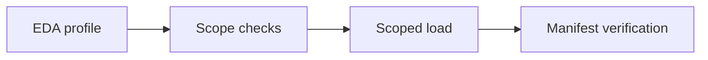

# Data Module

This module profiles the LATAM banking CSV dataset, selects a bounded ingestion
window, loads customer-owned data into PostgreSQL, and verifies the load manifest.
Run the commands below from the repository root. Use Python 3.11+ and `uv`.

## Installed package and CLI adapters

Install this project's dependencies from repository root before running the commands
below:

```powershell
rtk proxy uv sync --directory app\business-api\data --frozen --group dev
```

Implementation lives in [src/banking_data](src/banking_data/):

- [analysis](src/banking_data/analysis/) owns source inspection, EDA and scope analysis.
- [ingestion](src/banking_data/ingestion/) owns pipeline orchestration, mapping,
  loading and manifest verification.
- [snapshots](src/banking_data/snapshots/) owns estimated monthly snapshot calculation,
  persistence and verification.
- [seed_demo_users.py](src/banking_data/seed_demo_users.py) is the explicit demo seed
  CLI; Identity owns the provisioning implementation.

The checkout [scripts](scripts/) and package-root compatibility modules remain thin
CLI adapters. Keep the documented pipeline entrypoint; do not duplicate its logic
or add runtime import-path repair. Alembic configuration and migrations remain in
this project outside `src`.

## Export fraud-marked transaction CSV records

[export_fraud_transactions.py](scripts/export_fraud_transactions.py) scans every CSV
under `month=*/day=*` in `C:\Factored\data\transactions` and exports
complete rows whose `is_fraud` value is `true` (case-insensitive) or `1`. It streams
records without loading the year into memory and never modifies source files or
connects to PostgreSQL.

```powershell
rtk proxy uv run --directory app\business-api\data python scripts\export_fraud_transactions.py --output C:\Factored\fraud_2026.csv
```

Select a year or an inclusive date range (including ranges across years):

```powershell
rtk proxy uv run --directory app\business-api\data python scripts\export_fraud_transactions.py --year 2025 --output C:\Factored\fraud_2025.csv
rtk proxy uv run --directory app\business-api\data python scripts\export_fraud_transactions.py --start-date 2025-12-01 --end-date 2026-02-28 --output C:\Factored\fraud_range.csv
```

With `--year` or date bounds, the default source is `C:\Factored\data\transactions`.
Without either, the original 2026 default is preserved. `--source` accepts a
transactions root (`year=*/month=*/day=*`) or a single-year directory
(`month=*/day=*`). Selection uses partition dates, not the CSV's transaction or
process date fields; complete matching rows remain unchanged. Either date bound
can be omitted for an open-ended scan. Do not combine `--year` with date bounds.
Reversed ranges, invalid dates and periods without CSV files fail.

Omit `--output` to emit CSV on stdout; the count and errors go to stderr.
Output files must be new and outside the source directory. All selected
partitions must share the same columns, including
`transaction_id` and `is_fraud`. Invalid records fail with exit code 1; discard any
partial output from a failed run. A successful scan without matches emits only the
CSV header. Treat exported records as sensitive local data; do not commit them.

## Schema and ownership

The authoritative SQLModel definitions live in
[banking model families](../shared/src/banking_shared/models/) and
[Identity models](../shared/src/banking_shared/identity_models.py). This module's
[models](src/banking_data/models.py) and
[database helpers](src/banking_data/database.py) are compatibility reexports;
Alembic owns schema evolution, not ingestion or service startup.

| Owner / purpose                       | Tables                                                                                                                                       | Population path                                    |
| ------------------------------------- | -------------------------------------------------------------------------------------------------------------------------------------------- | -------------------------------------------------- |
| CSV ingestion                         | `branches`, `customers`, `products`, `transactions`                                                                                          | Dependency-ordered pipeline                        |
| Identity                              | `users`, `roles`, `user_roles`, `customer_users`, `operators`, `identity_audits`                                                             | Identity operations, migrations and explicit seeds |
| Historical archives                   | `legacy_service_agents`, `legacy_operator_service_agents`                                                                                    | Catalog-retirement migration; never new CSV loads  |
| Estimated projections                 | `product_monthly_snapshots`                                                                                                                  | Explicit snapshot builder                          |
| Dispute workflow and recorded effects | `support.support_cases`, `support.support_case_events`, `support.runtime_postings`, `support.card_protections`, `support.case_conversations` | Authorized application service operations          |

The [migration chain](alembic/versions) ends at
[revision 20261005_0012](alembic/versions/20261005_0012_case_conversation_history.py).
This is the source head, not proof of the revision applied to any database.
Revision `20261005_0012` creates `support`, moves the four existing support-domain tables
without recreating rows, and adds immutable customer-provided conversation snapshots.
Banking and Identity tables remain in `public`; no global search-path change is needed.
Alembic reflection includes only managed tables in the default and `support` schemas,
so unrelated or retained tables are not automatic drop candidates.
Downgrade is blocked pending explicit evidence-retention review.

A database still reporting withdrawn revision `20261004_0012` cannot upgrade through
this source chain (`20261005_0012` descends from `20261004_0011`). The new revision
was renumbered from 0013 with owner approval; its full ID remains distinct from the
withdrawn refresh revision `20261004_0012`. Renumbering does not repair that database's
migration marker or revert its retained tables. Do not stamp, downgrade, recreate the
withdrawn migration or remove retained refresh tables implicitly; lineage recovery
requires separate authorization.

The authorized local recovery and populated migration were completed on 2026-10-05:
the owner had removed the empty withdrawn refresh tables, then the migration marker
was corrected to `20261004_0011` and upgraded to `20261005_0012`. Verification
preserved seven cases, 34 events, the empty posting/protection tables and all 13
other public-table counts. The new conversation table was empty with its restrictive
foreign key. The local backup catalog was validated; restore was not tested.
This is local migration evidence only, not deployed-schema, browser, authorization,
contention or financial-effect acceptance. Other environments require independent
lineage inspection and authorization; do not repeat marker correction by default.

Revision 0010 archives simulated reviewers and former operator mappings, preserving
historical case references and audit text without inventing real ownership.
New loads do not require `service_agents.csv`. Older manifests can check its count
against the archive and still verify their original source checksums.

See [Identity contracts and provisioning](../identity/README.md),
[ADR 0006: Dedicated auth users and staff identities](../../../docs/adr/0006-dedicated-auth-users-and-staff-identities.md),
[ADR 0008: Operator ownership without a service-agent catalog](../../../docs/adr/0008-operator-ownership-without-service-agent-catalog.md),
and [Transaction adjudication and recorded effects](../transaction/README.md#adjudication-and-recorded-financial-effects)
for service-owned behavior. Migrating these tables does not populate them or prove
REST/MCP, browser, concurrency or deployed acceptance.

## Migration prerequisites

Confirm the database target, backup, authorized write operation and legacy identity
policy before upgrading a populated database. Identity revisions preflight bounded
fields, role memberships and customer associations; later revisions add operator
ownership and recorded-effect contracts. Do not reset a populated database to
bypass a preflight failure or infer staff ownership from archived reviewer IDs.

```powershell
rtk proxy uv run --project app\business-api\data --env-file <approved-env-file> alembic -c app\business-api\data\alembic.ini -x legacy-user-status=<approved-active-or-inactive> upgrade head
```

Replace the policy value with exactly `active` or `inactive` when migrating legacy
users. Never silently activate them. Backups require independent restore validation;
offline migration tests do not establish live rollback or PostgreSQL concurrency.

## Environment

Copy [.env.example](.env.example) to the ignored local `.env`, configure the approved
target and pass the file explicitly to `uv`. Never print connection credentials or
place passwords in command arguments, reports or source control.

| Variable                   | Purpose                                                                             |
| -------------------------- | ----------------------------------------------------------------------------------- |
| `DATABASE_URL`             | PostgreSQL SQLAlchemy connection URL for database scripts                           |
| `DATA_SOURCE_DIR`          | Required pipeline root containing dimension CSVs and transaction partitions         |
| `DATA_ARTIFACTS_DIR`       | EDA and scope output directory; defaults to this module's `artifacts`               |
| `DATA_MANIFEST_DIR`        | Load-manifest directory, not a JSON filename; also defaults to `artifacts`          |
| `DEMO_USER_PASSWORD`       | Explicit customer identity seeding only; no default                                 |
| `ADMIN_BOOTSTRAP_EMAIL`    | First-administrator email for Identity's explicit `--credentials-from-env` mode     |
| `ADMIN_BOOTSTRAP_PASSWORD` | First-administrator password for that mode; must differ from the demo-user password |

Neither customer-seeding nor administrator credentials are ingestion prerequisites.
The pipeline does not run Alembic, provision identities, build snapshots or evaluate
fraud thresholds. Administrator settings are consumed by the separate
[Identity bootstrap CLI](../identity/README.md#explicit-administrator-bootstrap),
not by data ingestion.

## Canonical ingestion pipeline

Use [run_pipeline.py](scripts/run_pipeline.py) for normal operation:



```powershell
rtk proxy uv run --project app\business-api\data --env-file app\business-api\data\.env python app\business-api\data\scripts\run_pipeline.py --start-date 2026-03-01 --end-date 2026-05-31 --customer-ids CUSTOMER_A,CUSTOMER_B
```

Dates are required, inclusive and ordered. For one day, supply the same date twice.
`--batch-size` must be positive and defaults to `50`. Customer filtering is optional;
for demo loads, prefer at most three explicitly selected customers.

The pipeline stops on a nonzero stage exit or a scope manifest without
`"approved": true`. Scope approval is an automatic quality-threshold check, not
human authorization for a database write. Default checks permit a maximum null rate
of `0.3` and duplicate rate of `0.05`, and reject missing daily partitions.

### Customer filtering and normalization

`--customer-ids` accepts one comma-separated string, trims whitespace and removes
duplicates. A supplied empty selection is rejected. Every requested customer must
exist; selected transactions must reference products within the same cohort.

| Table          | Filter behavior                                          |
| -------------- | -------------------------------------------------------- |
| `branches`     | Complete shared catalog                                  |
| `customers`    | Selected customer IDs                                    |
| `products`     | Products owned by selected customers                     |
| `transactions` | Selected customers within the requested partition window |

Filtering reduces writes, not the need to scan source CSVs. EDA uses the same
customer filter for customer-owned tables. Optional invalid branch references are
normalized to null and counted as adjustments.

Customer statuses normalize to `Active`, `Inactive`, `Suspended` or `Closed`;
blank legacy values remain null. Unknown statuses and overlength Customer fields
reject loading rather than truncate data. Business status is independent of User
login status.

Product types normalize through the
[canonical product catalog](../shared/src/banking_shared/product_types.py): Savings
Account, Checking Account, Investment, Mortgage Loan, Personal Loan, Insurance,
Credit Card and Debit Card. Known Spanish labels accept whitespace, case and accent
normalization. Unknown scoped types reject the dimension transaction. Account and
Transaction queries use canonical English values; the BFF is DB-free, not a
financial-query layer. Normalization code does not prove existing-row parity.

Transaction mapping includes `amount_usd`, `transaction_country`,
`transaction_city`, `response_code`, `is_fraud` and `fraud_score`. Missing fraud
scores remain missing; ingestion does not compute or invent them.

### Commits and partial failures

Branches, customers and products share one dimension transaction, committed before
transaction loading. Each transaction day commits or rolls back independently;
a failed day does not undo successful days or prevent later days from running.
The manifest records `completed_with_errors` if any day fails.

**A successful pipeline exit is not proof that every requested day loaded.** The
loader can exit successfully after partial failures, and verification accepts
`completed_with_errors` when its checks pass and rejected rows are zero. Inspect
per-day outcomes and failed-day details before claiming complete-window success.

### Artifacts and verification

The pipeline generates `eda_profile_<window>.json`, `scope_manifest_<window>.json`
and `load_manifest_<window>.json`. A one-day window uses one ISO date; a range uses
both endpoints. Filtered names append `customers-<count>-<hash>`, using normalized,
sorted IDs and the first eight SHA256 characters. The same cohort/window reuses
filenames: preserve copies separately when immutable execution history is needed.

The load manifest records checksums, processed counts, adjustments, customer-filter
metadata and per-day outcomes. Verification consumes that exact manifest:

- Branch counts are global; Customer/Product counts and orphan checks use the cohort.
- Transaction counts use source rows and successfully loaded dates.
- Source checksums detect changed input files.

The loader currently hardcodes `migration_revision` to `20260928_0001`; this field
is not a reliable database-head assertion. Check Alembic separately. Count/orphan
verification does not establish field-level semantics, complete-window success,
runtime-effect reconciliation or customer-facing service parity.

### Repeatability and runtime effects

Primary-key upserts avoid duplicate source rows when a window is repeated. Existing
source rows can change. Runtime transaction IDs are protected from ingestion
updates by both a precheck and the PostgreSQL conflict condition.

Product upserts still replace source `current_balance` and `product_status`.
Consequently, reloading products is **not** a guarantee that recorded runtime balance
or protection effects survive. Review this separately before reloading a database
with operational effects; do not treat ingestion idempotency as financial reconciliation.

## Script inventory

Use individual stages only for diagnosis or an explicitly scoped rerun. Keep dates,
customer IDs and artifact paths aligned; prefer the orchestrator for ordinary loads.
Each script exposes its argument contract through `--help`.

| Script                                                                       | Inputs / purpose                                                          | Boundary                                                                                            |
| ---------------------------------------------------------------------------- | ------------------------------------------------------------------------- | --------------------------------------------------------------------------------------------------- |
| [run_pipeline.py](scripts/run_pipeline.py)                                   | Environment, explicit dates and optional cohort                           | Runs the four ingestion stages only                                                                 |
| [inspect_sources.py](scripts/inspect_sources.py)                             | `--source`, `--output`, optional dates; columns, row counts and checksums | Metadata inventory, not semantic verification                                                       |
| [eda_profile.py](scripts/eda_profile.py)                                     | Source CSV profiling, nulls and capped distinct samples                   | `top_values` can be sampled; not exact full frequencies                                             |
| [eda_select_scope.py](scripts/eda_select_scope.py)                           | Profile, dates and output scope manifest                                  | Automatic thresholds; not human consent                                                             |
| [load_scoped_data.py](scripts/load_scoped_data.py)                           | Source, dates and load manifest                                           | Direct invocation does not consume or enforce scope approval                                        |
| [verify_load.py](scripts/verify_load.py)                                     | Source and exact load manifest                                            | Checks checksums, scoped counts and orphans                                                         |
| [seed_demo_users.py](scripts/seed_demo_users.py)                             | Selected customers and externally supplied password                       | Explicit identity provisioning/refresh                                                              |
| [profile_transaction_semantics.py](scripts/profile_transaction_semantics.py) | PostgreSQL aggregates and optional cohort                                 | Coverage/distributions include all source kinds; ownership/currency mismatch checks use source rows |
| [evaluate_fraud_threshold.py](scripts/evaluate_fraud_threshold.py)           | `--source`, `--output`, optional dates/thresholds and `--describe`        | Offline CSV analysis against synthetic labels; no customer filter or online detection               |
| [build_monthly_snapshots.py](scripts/build_monthly_snapshots.py)             | PostgreSQL products/transactions, cohort and optional months              | Estimated projection; supports non-persisting `--dry-run`                                           |
| [verify_monthly_snapshots.py](scripts/verify_monthly_snapshots.py)           | Same cohort/months as builder                                             | Shared-calculation consistency, not independent accounting reconciliation                           |

Source normalization belongs to [source_mapping.py](src/banking_data/ingestion/source_mapping.py).
[scoped_loading.py](src/banking_data/ingestion/scoped_loading.py) owns loading coordination:
dimensions commit before transactions, and each transaction day commits or rolls back
independently. A failed day does not stop later days. The loader CLI persists the
returned manifest through [load_manifest.py](src/banking_data/ingestion/load_manifest.py),
which also owns checksum validation and verification scope. The
[persisted verifier](src/banking_data/ingestion/verify_load.py) validates that contract before
opening a database connection and checks transactions only on successful load days.

The fraud-threshold analysis reports TP/FP/TN/FN, precision, recall and F1. Missing
labels are skipped and missing scores counted. Percentiles in describe mode use a
sample (`--sample-every 50` by default). Results do not change service triage policy.

## Explicit demo identity seeding

Identity owns provisioning policy, credential hashing, associations and audits in
[provisioning.py](../identity/src/identity/services/provisioning.py). The Data
[seed adapter](src/banking_data/seed_demo_users.py) preserves the existing CLI and
handles environment inputs and manifest output. Provisioning commits the selected
cohort once; it is separate from source loading and requires explicit write approval.

After migrations and an approved customer load, supply `DEMO_USER_PASSWORD` outside
source control and explicitly run:

```powershell
rtk proxy uv run --project app\business-api\data --env-file app\business-api\data\.env python app\business-api\data\scripts\seed_demo_users.py --customer-ids CUSTOMER_A,CUSTOMER_B
```

Outer password whitespace is trimmed. When `ADMIN_BOOTSTRAP_PASSWORD` is configured,
seeding rejects the same password before database access. Passwords/hashes are never
written to the output manifest.

The seed uses stored Customer email, controlled customer-role membership and
`CustomerUser` associations. Names join trimmed nonempty first/last components,
or remain null if both are absent. Country `Brazil`/`Brasil` defaults to `pt`;
other countries default to `es`. `--locale` explicitly overrides the selected cohort.

New identities are active. **Refresh rotates credentials, activates the selected
identity and increments `identity_version`, invalidating existing tokens.** It
preserves subject and creation time; never use it implicitly as a name-only repair.
Unknown customers are reported and skipped, while email collisions or invalid
associations roll back the seed. Successful writes record secret-free
`customer_migrate` audits and a non-secret manifest. Unselected users remain unchanged.

Normal ingestion does not seed or activate users. The
[Responses BFF](../../responses-bff/README.md) forwards Identity operations;
it never reads PostgreSQL or verifies passwords.

### First-administrator bootstrap

Administrator provisioning belongs to Identity's `banking-bootstrap-admin` CLI,
implemented in [bootstrap.py](../identity/src/identity/services/bootstrap.py), not to
[seed_demo_users.py](scripts/seed_demo_users.py). It requires migrated roles, a
separately approved database/write operation, `--locale` and `--confirm-bootstrap`.
It refuses an existing administrator or email identity; it is not a reset or
promotion command and never runs at application startup.

The default mode prompts for a hidden password and confirmation. Only explicit
`--credentials-from-env` mode consumes `ADMIN_BOOTSTRAP_EMAIL` and
`ADMIN_BOOTSTRAP_PASSWORD`. Keep `DEMO_USER_PASSWORD` and
`ADMIN_BOOTSTRAP_PASSWORD` configured during either provisioning path to enforce
the distinct-password check before database access.

See the [Identity administrator-bootstrap guide](../identity/README.md#explicit-administrator-bootstrap)
for commands, input constraints and the Windows example that loads Identity settings
alongside this module's ignored `.env`. Both environment files must target the same
approved database; setting variables alone does not authorize or execute provisioning.

## Estimated monthly snapshots

Snapshots reconstruct product closing balances from persisted data; they are
estimates, not an external accounting ledger or a CSV reload.
[snapshot_calculations.py](src/banking_data/snapshots/snapshot_calculations.py) contains pure
calculations; [snapshot_inputs.py](src/banking_data/snapshots/snapshot_inputs.py) fetches and
projects persisted inputs; [snapshot_repository.py](src/banking_data/snapshots/snapshot_repository.py)
upserts without committing. The [builder CLI](src/banking_data/snapshots/build_monthly_snapshots.py)
commits once after all batches; `--dry-run` neither upserts nor commits. Profile semantics
before calculating them:

```powershell
rtk proxy uv run --project app\business-api\data --env-file app\business-api\data\.env python app\business-api\data\scripts\profile_transaction_semantics.py --customer-ids CUSTOMER_A,CUSTOMER_B
rtk proxy uv run --project app\business-api\data --env-file app\business-api\data\.env python app\business-api\data\scripts\build_monthly_snapshots.py --customer-ids CUSTOMER_A,CUSTOMER_B --dry-run
```

| Canonical source value                          | Default estimation treatment                                         |
| ----------------------------------------------- | -------------------------------------------------------------------- |
| `Approved`                                      | Source transactions included; other statuses have no movement effect |
| `Deposit`                                       | Credit                                                               |
| `Payment`, `Purchase`, `Transfer`, `Withdrawal` | Debit; Transfer is outbound from the row's product                   |
| `Adjustment`                                    | Excluded because direction is unknown                                |

Rows store the policy and current-balance anchor. Excluded approved amounts are
reported for each month; accumulated excluded amounts between closing and the
anchor define the uncertainty amount. The estimated range is closing balance plus
or minus that amount, not a guaranteed error bound against an external ledger.

Default months run from the first transaction month through the month before the
latest transaction. Explicit `--start-month`/`--end-month` require first-of-month
ISO dates. Omitted customer IDs require `--allow-all-customers`. Override
`--credit-types`, `--debit-types` and `--excluded-types` together; disjoint sets must
classify every observed approved type.

After authorizing persistence, remove `--dry-run`; rows upsert by
`(product_id, snapshot_month)`. Verify with the identical customer scope and months:

```powershell
rtk proxy uv run --project app\business-api\data --env-file app\business-api\data\.env python app\business-api\data\scripts\verify_monthly_snapshots.py --customer-ids CUSTOMER_A,CUSTOMER_B
```

Coverage includes all transaction source kinds, but reconstructed movements include
only approved source rows. The current Product balance may already contain runtime
compensation. These inputs are not a reconciled source/runtime accounting model.
The verifier reuses builder logic: passing confirms calculation consistency, not
independent financial accuracy or actual frontend use.

## Focused checks and related guides

[Data tests](tests) cover pipeline orchestration, normalization, seeding, manifests,
snapshots, schema/migrations and runtime transaction collision protection. That
collision coverage does not prove Product balance/status preservation.

```powershell
rtk proxy uv run --directory app\business-api\data --offline pytest tests\test_run_pipeline.py tests\test_legacy_manifest_verification.py tests\test_runtime_ingestion.py -q
```

This is a check command, not a recorded result. See the
[business API guide](../README.md), [Identity guide](../identity/README.md),
[Transaction guide](../transaction/README.md) and
[deployment guide](../../../docs/deployment-guide.md) for service contracts and rollout.
Keep offline, local PostgreSQL, customer-facing and deployed evidence separate.
