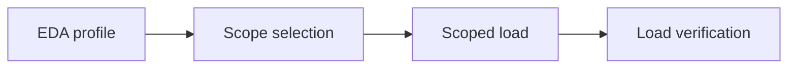

# Data Module

This module profiles the LATAM banking CSV dataset, approves a bounded transaction
window, loads it into PostgreSQL, and verifies the resulting rows and source checksums.
Run every command from the repository root.

## Scope

The loader upserts tables in dependency order:

1. `branches`
2. `customers`
3. `service_agents`
4. `products`
5. `transactions`

The pipeline does not populate the `users` table. Create selected demo identities
separately with `seed_demo_users.py` after their customer rows have been loaded.

## Product Types

Ingestion normalizes `products.product_type` using the shared
[product catalog](../shared/banking_shared/product_types.py). Canonical labels are
Savings Account, Checking Account, Investment, Mortgage Loan, Personal Loan,
Insurance, Credit Card and Debit Card. Known Spanish source labels, including
both personal-loan spellings, are accepted with surrounding whitespace, case and
accent normalization. Unknown scoped types reject the dimension transaction before
commit; products outside a selected customer filter do not affect that load.

Account, Transaction and BFF category queries use only canonical English labels.
Spanish compatibility belongs to ingestion normalization, not database query filters.
BFF product types and Account
card names are canonical English; Account card `type` remains `credit`/`debit`.
This does not migrate existing database rows. The user reports manually converting
historical labels; that conversion was not independently verified in this follow-up.
Rerun live scoped parity verification before closing the data gate.
The existing manifest count/orphan checks do not independently verify label semantics.

## Pipeline

Use `run_pipeline.py` for normal operation. It executes the individual scripts in this
order and stops if a command fails or EDA does not approve the requested window.



The user supplies `--start-date` and `--end-date`. For a one-day migration, use the same
date for both arguments. The optional `--customer-ids` argument accepts one comma-separated
string and limits customer-owned data to those IDs.

## Environment

The local `app/business-api/data/.env` file must define:

```dotenv
DATABASE_URL=postgresql+psycopg://...
DATA_SOURCE_DIR=C:/Factored/data
DATA_ARTIFACTS_DIR=C:/Factored/factored-hackathon-2026-cristopher-coronado/app/business-api/data/artifacts
DATA_MANIFEST_DIR=C:/Factored/factored-hackathon-2026-cristopher-coronado/app/business-api/data/artifacts
DEMO_USER_PASSWORD=
```

| Variable             | Purpose                                                                           |
| -------------------- | --------------------------------------------------------------------------------- |
| `DATABASE_URL`       | PostgreSQL SQLAlchemy connection URL.                                             |
| `DATA_SOURCE_DIR`    | Directory containing dimension CSVs and the partitioned `transactions` directory. |
| `DATA_ARTIFACTS_DIR` | Directory for EDA profiles and scope manifests.                                   |
| `DATA_MANIFEST_DIR`  | Directory for load manifests. This is a directory, not a JSON filename.           |
| `DEMO_USER_PASSWORD` | Shared password hashed for users created by `seed_demo_users.py`.                 |

The orchestrator derives a new manifest filename from the requested window. A fixed
`DATA_MANIFEST_PATH` is intentionally not used because it would overwrite the evidence
from a previous run.

Always pass the environment file explicitly to `uv`; it is ignored by Git and is not
loaded automatically.

Copy `app/business-api/data/.env.example` to the ignored
`app/business-api/data/.env`, replace its example values, and keep the real password out
of source control.

## Recommended Command

### Migrate one day

This command runs all four pipeline stages for March 1, 2026:

```powershell
uv run --project app/business-api/data --env-file app/business-api/data/.env python app/business-api/data/scripts/run_pipeline.py --start-date 2026-03-01 --end-date 2026-03-01
```

### Migrate a date range

This command runs all four stages for every daily partition from March 1 through May 31:

```powershell
uv run --project app/business-api/data --env-file app/business-api/data/.env python app/business-api/data/scripts/run_pipeline.py --start-date 2026-03-01 --end-date 2026-05-31
```

`--batch-size` is optional and defaults to `50`.

### Migrate selected customers

For a demo-sized load, pass at most three customer IDs as one comma-separated string:

```powershell
uv run --project app/business-api/data --env-file app/business-api/data/.env python app/business-api/data/scripts/run_pipeline.py --start-date 2026-03-01 --end-date 2026-03-01 --customer-ids CUSTOMER_A,CUSTOMER_B,CUSTOMER_C
```

The parser trims whitespace and removes duplicate IDs. A supplied value that contains no
IDs is rejected. The loader also fails before committing dimensions when a requested ID is
not present in `customers.csv`.

The filter affects these tables:

| Table            | Filter behavior                                                     |
| ---------------- | ------------------------------------------------------------------- |
| `branches`       | Loads the complete shared catalog.                                  |
| `customers`      | Loads only requested customer IDs.                                  |
| `service_agents` | Loads the complete shared catalog.                                  |
| `products`       | Loads products owned by requested customers.                        |
| `transactions`   | Loads transactions owned by requested customers in the date window. |

Filtering reduces PostgreSQL writes, but the pipeline still scans the source CSV files to
find matching rows. EDA profiles customer-owned tables using the same filter.

## Artifact Names

Every pipeline run produces three JSON artifacts. One day uses one date in each name;
a range uses both inclusive endpoints.

| Run     | EDA profile                              | Scope manifest                              | Load manifest                              |
| ------- | ---------------------------------------- | ------------------------------------------- | ------------------------------------------ |
| One day | `eda_profile_2026-03-01.json`            | `scope_manifest_2026-03-01.json`            | `load_manifest_2026-03-01.json`            |
| Range   | `eda_profile_2026-03-01_2026-05-31.json` | `scope_manifest_2026-03-01_2026-05-31.json` | `load_manifest_2026-03-01_2026-05-31.json` |

Filtered runs append `customers-<count>-<hash>` to all three names. The stable hash is
derived from the normalized customer IDs, so rerunning the same customer set uses the same
artifacts while a different set does not overwrite them.

The load manifest is the audit record for one execution. It contains source checksums,
processed row counts, data adjustments, per-day outcomes, and failed-day details.
It also records `customer_filter.mode` and the normalized `customer_filter.customer_ids`
array. Verification always receives the exact manifest generated by the load stage and
scopes customer-owned count and orphan checks to those IDs.

## Transaction Behavior

Dimensions are committed before transaction partitions. Transactions are then processed
one day at a time:

- A successful day commits independently.
- A failed day rolls back only that day.
- Remaining days continue loading.
- The manifest status is `completed_with_errors` when any day fails.

Progress output includes:

```text
OK day=YYYY-MM-DD rows=N progress=X/Y
FAIL day=YYYY-MM-DD progress=X/Y error=...
Summary days_total=N days_loaded=N days_failed=N rows_loaded_total=N
```

## Idempotency

EDA and scope selection only read source files and overwrite artifacts with the same
date-derived name. Loading uses PostgreSQL upsert by primary key, so repeating a window
does not create duplicate rows. Existing rows with matching primary keys are updated.

## Seed Demo Users

After loading the selected customers, create their persisted login identities with one
shared password from `DEMO_USER_PASSWORD`:

```powershell
uv run --project app/business-api/data --env-file app/business-api/data/.env python app/business-api/data/scripts/seed_demo_users.py --customer-ids CUSTOMER_A,CUSTOMER_B,CUSTOMER_C
```

The command uses each customer's stored email. Locale is inferred from `customers.country`:
`Brazil` or `Brasil` maps to `pt`, and every other country maps to `es`. Pass
`--locale es` or `--locale pt` only when every selected user needs the same explicit
override.

Seeding is idempotent by `customer_id`. Existing matching users keep their user ID while
email, password hash, and locale are refreshed. Users outside the selected list are not
deleted or changed. Unknown customer IDs are reported and skipped without stopping valid
customers in the same command. A non-secret manifest is written under
`DATA_ARTIFACTS_DIR`.

The [Responses BFF](../../responses-bff/README.md) authenticates directly against these persisted rows. Configure its
`DATABASE_URL` to point to the same database; no user JSON or copied password hash is
required in the BFF environment.

## Monthly Product Snapshots

`product_monthly_snapshots` is an estimated operational projection built from the existing
PostgreSQL `products` and `transactions` rows. It does not rerun CSV ingestion. Each row
stores a product's reconstructed closing balance for one complete calendar month, that
month's approved transaction movement, and the current-balance anchor used by the
calculation.

The source stores every transaction amount as a positive value and does not provide a
debit/credit direction column. Profile the selected data before building snapshots:

```powershell
uv run --project app/business-api/data --env-file app/business-api/data/.env python app/business-api/data/scripts/profile_transaction_semantics.py --customer-ids CUSTOMER_A,CUSTOMER_B
```

The profile reports aggregate statuses, types, signs, date coverage, and product ownership
or currency mismatches. The dataset has no external accounting source, signed amount,
transfer destination, or reversal reference. Digital events were also tested as a possible
cross-check, but they do not link to transactions by identifier, amount, or time.

The snapshot scripts therefore use this explicit default estimation policy:

| Source value                                    | Snapshot treatment                                   |
| ----------------------------------------------- | ---------------------------------------------------- |
| `Approved`                                      | Included; every other status has zero balance effect |
| `Deposit`                                       | Credit                                               |
| `Payment`, `Purchase`, `Transfer`, `Withdrawal` | Debit                                                |
| `Adjustment`                                    | Excluded because its direction is unknown            |

`Transfer` is treated as an outbound movement from the row's `product_id`. The policy is
stored on every snapshot. `excluded_approved_transaction_amount` reports the unsigned
adjustments in that month, while `balance_uncertainty_amount` accumulates excluded amounts
between the snapshot close and the current-balance anchor. The estimated balance range is
`closing_balance ± balance_uncertainty_amount`.

Apply the schema migration after the classification is approved:

```powershell
uv run --project app/business-api/data --env-file app/business-api/data/.env alembic -c app/business-api/data/alembic.ini upgrade head
```

Run a non-persisting calculation first. The default policy above requires no classification
arguments:

```powershell
uv run --project app/business-api/data --env-file app/business-api/data/.env python app/business-api/data/scripts/build_monthly_snapshots.py --customer-ids CUSTOMER_A,CUSTOMER_B --dry-run
```

```powershell
uv run --project app/business-api/data --env-file app/business-api/data/.env python app/business-api/data/scripts/build_monthly_snapshots.py --customer-ids CUSTOMER_A,CUSTOMER_B
```

The default window begins in the first loaded transaction month and ends in the month
before the latest loaded transaction date. This excludes a partial current month. Use
first-of-month ISO dates with `--start-month` and `--end-month` to narrow the window.
Rebuilding is idempotent by `(product_id, snapshot_month)`.

Verify with the identical customer scope and optional month boundaries:

```powershell
uv run --project app/business-api/data --env-file app/business-api/data/.env python app/business-api/data/scripts/verify_monthly_snapshots.py --customer-ids CUSTOMER_A,CUSTOMER_B
```

Use `--credit-types`, `--debit-types`, and `--excluded-types` together to override the
default. The three sets must be disjoint and classify every observed approved type.

Omitting `--customer-ids` requires the explicit `--allow-all-customers` switch because an
unscoped build may create snapshots for every product.

## Individual Commands

These commands are intended for diagnosis or rerunning one stage. Execute them in the
listed order and keep all dates and artifact paths aligned.

### 1. Create the EDA profile

```powershell
uv run --project app/business-api/data --env-file app/business-api/data/.env python app/business-api/data/scripts/eda_profile.py --source C:\Factored\data --output app/business-api/data/artifacts/eda_profile_2026-03-01.json --start-date 2026-03-01 --end-date 2026-03-01
```

### 2. Select and approve the scope

```powershell
uv run --project app/business-api/data --env-file app/business-api/data/.env python app/business-api/data/scripts/eda_select_scope.py --profile app/business-api/data/artifacts/eda_profile_2026-03-01.json --output app/business-api/data/artifacts/scope_manifest_2026-03-01.json --start-date 2026-03-01 --end-date 2026-03-01
```

Confirm that the scope JSON contains `"approved": true` before loading manually.

### 3. Load the approved window

```powershell
uv run --project app/business-api/data --env-file app/business-api/data/.env python app/business-api/data/scripts/load_scoped_data.py --source C:\Factored\data --manifest app/business-api/data/artifacts/load_manifest_2026-03-01.json --start-date 2026-03-01 --end-date 2026-03-01 --batch-size 50
```

### 4. Verify the same load manifest

Run verification only after the loader has created the manifest:

```powershell
uv run --project app/business-api/data --env-file app/business-api/data/.env python app/business-api/data/scripts/verify_load.py --source C:\Factored\data --manifest app/business-api/data/artifacts/load_manifest_2026-03-01.json
```

If verification reports `FileNotFoundError`, the manifest path does not match the load
command or verification ran before loading completed.
