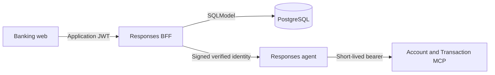

# Responses BFF

FastAPI browser trust boundary for the banking assistant. It authenticates PostgreSQL
users, returns persisted customer profiles and bank accounts, and proxies Responses
streams to the local agent or Foundry. The browser never receives Azure credentials.

## Request Flow



Profile and account-page reads use PostgreSQL directly from the BFF. Conversational
inquiries use the agent and MCP services; the BFF read endpoint does not replace their
service-layer ownership checks.

## HTTP Contract

| Method | Route               | Behavior                                                                                         |
| ------ | ------------------- | ------------------------------------------------------------------------------------------------ |
| POST   | `/auth/login`       | Verify persisted email and Argon2 password hash; return bearer token and user profile.           |
| GET    | `/auth/me`          | Return verified identity and persisted customer name. Requires bearer JWT.                       |
| GET    | `/auth/me/accounts` | Return owned savings and checking accounts. Requires bearer JWT.                                 |
| POST   | `/responses`        | Proxy Responses events with verified identity and user-bound conversations. Requires bearer JWT. |

JWT identity includes `sub`, `customer_id`, `email`, and `locale`, with `iss`, `aud`,
`iat`, and `exp` metadata. The display `name` is profile response data, not a JWT claim.
Missing customer names return `null`.

Account summaries contain `id`, `type`, nullable `status`, nullable `opened` (ISO date),
nullable `number`, and `currency`. Queries verify the persisted user/customer association,
filter `Cuenta Ahorro` and `Cuenta Corriente`, and order by product ID. The endpoint
does not accept a customer identifier to select another customer's accounts. No accounts
returns an empty array; database/configuration failures return a safe `503` response.
Missing or invalid bearer credentials return `401`.

## Local Development

Run from the repository root using the ignored root `.env.dev`:

```powershell
uv sync --project app/responses-bff
uv run --project app/responses-bff --env-file .env.dev uvicorn bff.main:app --app-dir app/responses-bff --port 8080
```

Set `PROFILE=dev`, `RESPONSES_UPSTREAM_MODE=local`, and
`RESPONSES_AGENT_ENDPOINT=http://127.0.0.1:8088/responses` in that environment.
The root `DEV - Full Stack Ordered` launch starts this service with the MCP services,
agent, and frontend. Restart the BFF after Python edits when running without `--reload`.

## Configuration

| Variable                   | Purpose / default                                                                                 |
| -------------------------- | ------------------------------------------------------------------------------------------------- |
| `DATABASE_URL`             | Shared SQLModel PostgreSQL connection URL; required for persisted login/profile/account reads.    |
| `JWT_SECRET_KEY`           | Application HS256 signing key, at least 32 characters.                                            |
| `JWT_ISSUER`               | `home-banking-api`                                                                                |
| `JWT_AUDIENCE`             | `home-banking-web`                                                                                |
| `JWT_ACCESS_TOKEN_MINUTES` | `15`; supported range `1` to `60`.                                                                |
| `INTERNAL_IDENTITY_SECRET` | Shared downstream identity signing secret, at least 32 characters.                                |
| `RESPONSES_UPSTREAM_MODE`  | `foundry` by default; use `local` for local browser validation.                                   |
| `RESPONSES_AGENT_ENDPOINT` | Local default `http://127.0.0.1:8088/responses`; configure the approved upstream for hosted mode. |
| `RESPONSES_TOKEN_SCOPE`    | `https://ai.azure.com/.default`                                                                   |
| `AZURE_CLIENT_ID`          | Optional client ID for server-side Azure credentials.                                             |
| `ALLOWED_ORIGINS`          | JSON array; defaults to `["http://localhost:5170"]`.                                              |

Keep secrets in ignored environment files or protected deployment settings. Never log
passwords, password hashes, JWTs, or Azure credentials. `AUTH_USERS` is not a login
source. Seed demo identities separately using the [data module guide](../business-api/data/README.md#seed-demo-users).
The shared models and session factory live in [banking-shared](../business-api/shared).

## Validation and Limits

```powershell
uv run --project app/responses-bff pytest app/responses-bff/tests -q
```

Tests cover persisted repository queries, authentication, profile/account responses,
ownership filtering, and Responses proxy behavior. Local login, customer-name display,
and account selection have been validated in the frontend. Hosted identity transport
still requires separate validation. Registration, password reset, MFA, revocation, and
production identity lifecycle controls are not implemented.

For zip packaging and dependency export, follow the
[root deployment artifact guide](../../README.md#python-dependency-artifact-for-app-service-zip-deploy).
