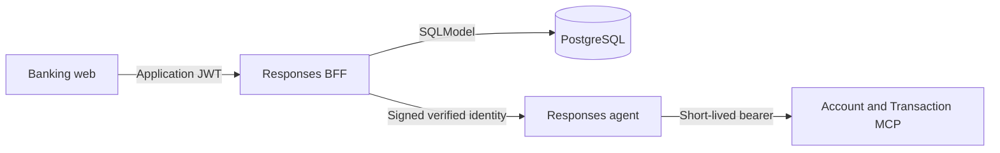

# Responses BFF

FastAPI browser trust boundary for the banking assistant. It authenticates PostgreSQL
users, returns persisted customer profiles, bank accounts, and credit/debit cards, and proxies Responses
streams to the local agent or Foundry. The browser never receives Azure credentials.

## Request Flow



Profile, account, card, Dashboard, and Analytics reads use PostgreSQL directly from the BFF. Conversational
inquiries use the agent and MCP services; the BFF read endpoint does not replace their
service-layer ownership checks.

## HTTP Contract

| Method | Route                                     | Behavior                                                                                                     |
| ------ | ----------------------------------------- | ------------------------------------------------------------------------------------------------------------ |
| POST   | `/auth/login`                             | Verify persisted email and Argon2 password hash; return bearer token and user profile.                       |
| GET    | `/auth/me`                                | Return verified identity and persisted customer name. Requires bearer JWT.                                   |
| GET    | `/auth/me/accounts`                       | Return owned savings and checking accounts. Requires bearer JWT.                                             |
| GET    | `/auth/me/cards`                          | Return owned credit and debit cards with masked numbers. Requires bearer JWT.                                |
| GET    | `/accounts/{product_number}/transactions` | Return an owned bank account's transactions by number with date filters and pagination. Requires bearer JWT. |
| POST   | `/responses`                              | Proxy Responses events with verified identity and user-bound conversations. Requires bearer JWT.             |

JWT identity includes `sub`, `customer_id`, `email`, and `locale`, with `iss`, `aud`,
`iat`, and `exp` metadata. The display `name` is profile response data, not a JWT claim.
Missing customer names return `null`.

Account summaries contain `type`, nullable `status`, nullable `opened` (ISO date),
nullable `number`, `currency`, and nullable decimal-string `balance`. The balance is
the stored current value, not a historical balance for a transaction window.
Bank account numbers are returned in full. Product primary keys are never returned
in account, card, or transaction product references. Account and Transaction MCP
lookup parameters use `product_number`; card transaction tools additionally use
`card_product_number`. Internal product keys remain database relationship fields.
Queries verify the persisted user/customer association,
filter `Savings Account` and `Checking Account`, and order by product ID. The endpoint
does not accept a customer identifier to select another customer's accounts. No accounts
returns an empty array; database/configuration failures return a safe `503` response.
Missing or invalid bearer credentials return `401`.

### Cards

`GET /auth/me/cards` returns products of type `Credit Card` and `Debit Card`,
ordered by product ID. The query verifies both the authenticated `sub` and
`customer_id` against the persisted user/customer association. It lists customer-owned
cards without inferring a relationship to a particular bank account; bank-account
and transaction endpoints remain restricted to savings and checking products.

Card summaries contain the account-summary fields plus nullable `expires` (ISO date)
and nullable decimal-string `credit_limit`. Numbers are masked server-side as
`****` followed by the last four characters. Missing numbers or numbers with four
or fewer characters remain `null` rather than being disclosed in full. Missing dates, balances, and
limits remain `null`. Stored balance and limit are returned without calculating
available credit or utilization. No matching cards returns an empty array; missing
or invalid credentials return `401`, and database/configuration failures return `503`.
Payments, recharge, blocking, and limit changes are not implemented by this endpoint.

### Transactions

`GET /accounts/{product_number}/transactions` resolves the owned account by its full
product number, never by its database primary key, and accepts optional ISO calendar dates
`start_date` and `end_date` (inclusive), `limit` from 1 to 100 (default 100), and
nonnegative `offset` (default 0). Invalid parameters or a reversed date window
return `422`. Foreign, missing, or non-bank products return the same `404` response;
database/configuration failures return a safe `503`.

The response contains `items`, `total`, `limit`, `offset`, `start_date`, and `end_date`.
Each item includes transaction `id`, account `product_number`, `date`, decimal-string `amount`, `currency`,
and nullable `type`, `category`, `channel`, `merchant`, and `status`. Results are
ordered by transaction date and ID descending. An owned account with no matching
transactions returns an empty `items` array and zero `total`.

Ownership is checked against the persisted user/customer/product association before
reading transactions. Clients must fetch every page before computing window totals.
Pagination is not a cross-request database snapshot; concurrent changes may require
a refresh. Date bounds currently use naive datetimes against timezone-aware columns;
timezone-independent boundary behavior remains an open validation condition.

### Controlled Errors

Application-raised failures use `{"detail":{"code":"SERVICE_UNAVAILABLE"}}`
with an allow-listed code: `AUTH_REQUIRED`, `INVALID_CREDENTIALS`, `ACCESS_DENIED`,
`ACCOUNT_UNAVAILABLE`, `SERVICE_UNAVAILABLE`, `INVALID_DATE_RANGE`, or `INVALID_REQUEST`.
HTTP statuses and bearer challenges are preserved. Foreign and missing accounts remain
indistinguishable. Framework validation responses can retain their standard shape;
the frontend treats unknown codes, raw details and non-JSON responses as safe local
fallbacks rather than displaying server text. Successful Responses streams are unchanged.

The affected auth/accounts/Responses suite passed with 65 tests. A broader run had
83 passes and one unrelated user-repository fixture failure because it still stored
Spanish bank-product labels against English-only filters. This is not a fully green
BFF-suite result or new browser/hosted evidence.

## Local Development

Run from the repository root using the ignored root `.env.dev`:

```powershell
uv sync --project app/responses-bff
uv run --project app/responses-bff --env-file .env.dev uvicorn bff.main:app --app-dir app/responses-bff --port 8080
```

Set `PROFILE=dev`, `RESPONSES_UPSTREAM_MODE=local`, and
`RESPONSES_AGENT_ENDPOINT=http://127.0.0.1:8088/responses` in that environment.
The root `DEV - Full Stack Ordered` launch starts this service with the MCP services,
agent, and frontend. Restart the BFF after Python edits when running without `--reload`.

## Configuration

| Variable                   | Purpose / default                                                                                 |
| -------------------------- | ------------------------------------------------------------------------------------------------- |
| `DATABASE_URL`             | Shared SQLModel PostgreSQL connection URL; required for persisted login/profile/account reads.    |
| `JWT_SECRET_KEY`           | Application HS256 signing key, at least 32 characters.                                            |
| `JWT_ISSUER`               | `home-banking-api`                                                                                |
| `JWT_AUDIENCE`             | `home-banking-web`                                                                                |
| `JWT_ACCESS_TOKEN_MINUTES` | `15`; supported range `1` to `60`.                                                                |
| `INTERNAL_IDENTITY_SECRET` | Shared downstream identity signing secret, at least 32 characters.                                |
| `RESPONSES_UPSTREAM_MODE`  | `foundry` by default; use `local` for local browser validation.                                   |
| `RESPONSES_AGENT_ENDPOINT` | Local default `http://127.0.0.1:8088/responses`; configure the approved upstream for hosted mode. |
| `RESPONSES_TOKEN_SCOPE`    | `https://ai.azure.com/.default`                                                                   |
| `AZURE_CLIENT_ID`          | Optional client ID for server-side Azure credentials.                                             |
| `ALLOWED_ORIGINS`          | JSON array; defaults to `["http://localhost:5170"]`.                                              |

Keep secrets in ignored environment files or protected deployment settings. Never log
passwords, password hashes, JWTs, or Azure credentials. `AUTH_USERS` is not a login
source. Seed demo identities separately using the [data module guide](../business-api/data/README.md#seed-demo-users).
The shared models and session factory live in [banking-shared](../business-api/shared).

## Validation and Limits

```powershell
cd app/responses-bff
uv run python -m pytest tests -q
```

Tests cover persisted repository queries, authentication, profile/account responses,
transaction date filters and pagination, ownership filtering, and Responses proxy
behavior. Card contract tests cover credit/debit filtering, masked numbers, decimal
precision, null fields, cross-user isolation, invalid credentials, and unavailable
database responses. The focused account/card suite passed with 36 tests, and the
user confirmed that credit and debit cards appear in the local frontend. This does
not establish a complete two-user card browser/error matrix or deployed parity.
Local PostgreSQL comparisons and desktop browser login, balances, and
transaction rows passed for two approved users. Simulated transaction failures and
rejected sessions exercised UI recovery; natural JWT expiration remains unverified.

This is not evidence of complete conversational parity. The agent profile provider
uses the verified email from the signed BFF identity rather than a sample profile.
Unit tests cover profile isolation, number-only lookups, masked card output, and
ownership denials. User-supplied local browser evidence on 2026-09-30 confirms an
owned-account answer and a foreign-account lookup with `ACCESS_DENIED` followed by
a visible assistant denial. The full signed-chain missing/empty, Transaction,
multi-turn, and approval-continuation matrix remains open.

The frontend keeps conversation IDs only in React state. A reload sends the next
message without `conversation`; the BFF creates a new opaque ID bound to verified
`sub`. Subsequent messages reuse it, and another user's ID is rejected. The local
agent persists workflow checkpoints through the SDK filesystem store, not this BFF
or PostgreSQL. See the [agent state guide](../agent/README.md#conversation-state).

Beneficiaries has no persisted source. Hosted identity
transport and deployed parity still require separate validation.
Registration, password reset, MFA, revocation, and
production identity lifecycle controls are not implemented.

For zip packaging and dependency export, follow the
[root deployment artifact guide](../../README.md#python-dependency-artifact-for-app-service-zip-deploy).
