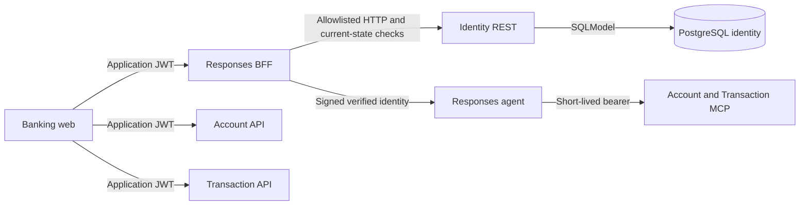

# Responses BFF

FastAPI database-free browser trust boundary for the banking assistant. It fronts
[Identity](../business-api/identity/README.md) through allowlisted authentication and
admin-operator routes, verifies application JWTs against current identity state, and
fronts the Responses agent. Identity alone verifies passwords and issues tokens.
The browser never receives Azure credentials. Financial reads go directly to Account
and Transaction with the same application JWT; staff roles cannot use those reads
or customer chat.

## Request Flow



Account, card, Dashboard, and Analytics reads call the
[Account and Transaction REST APIs](../business-api/README.md) directly over CORS,
each verifying the same JWT independently in its own `jwt_identity.py`. Conversational
inquiries use the agent and MCP services instead, authenticated through a separate
short-lived internal bearer; neither path replaces the other's service-layer
ownership checks.

## HTTP Contract

| Method | Route         | Behavior                                                                                         |
| ------ | ------------- | ------------------------------------------------------------------------------------------------ |
| POST   | `/auth/login` | Verify persisted email and Argon2 password hash; return bearer token and user profile.           |
| GET    | `/auth/me`    | Return verified identity and persisted customer name. Requires bearer JWT.                       |
| POST   | `/responses`  | Proxy Responses events with verified identity and user-bound conversations. Requires bearer JWT. |

JWT identity includes `sub`, `email`, `locale`, fixed `role`, and `identity_version`,
with `iss`, `aud`, `iat`, and `exp`; only customers have `customer_id`. Profile-only
`name`, `status`, and ISO `updated_at` are not JWT claims. Missing names return `null`.
Admin-only GET/POST `/admin/operators` and POST lifecycle routes (`activate`,
`deactivate`, `reset-password`) forward to Identity; the BFF never mutates a database.
Operator creation requires trimmed `first_name` and `last_name` (1–50 characters
each), email up to 120 characters, and a 12–256-character password. The legacy
creation `name` field is rejected. Password resets use the same password bounds.
The operator list preserves optional structured names for legacy profiles.
Admin-only GET `/admin/customers` and POST `/admin/customers/{user_id}/activate`
and `/deactivate` are explicit, body-free Identity forwards, checked against
uncached administrator identity on every request. They list existing customer users
and change sign-in access only, not banking customer status or financial data.
Customer creation, password reset, deletion, and generic Identity proxying are not
exposed. All browser authentication and administration stays behind this BFF.
An uncached, three-second Identity client validates active status and token version
for protected requests. Inactive/stale tokens return 401, wrong roles 403, and
Identity outages 503. Already admitted Responses streams are not cancelled, and
use a separate streaming client without that identity-request timeout. Account/card/transaction response shapes,
pagination, masking, and ownership rules are documented in the
[business-api README](../business-api/README.md) now that those reads live there
instead of in the BFF.

### Controlled Errors

Application-raised failures use `{"detail":{"code":"SERVICE_UNAVAILABLE"}}`
with an allow-listed code: `AUTH_REQUIRED`, `INVALID_CREDENTIALS`,
`SERVICE_UNAVAILABLE`, or `INVALID_REQUEST`. HTTP statuses and bearer challenges are
preserved. Framework validation responses can retain their standard shape; the
frontend treats unknown codes, raw details and non-JSON responses as safe local
fallbacks rather than displaying server text. Successful Responses streams are
unchanged.

## Local Development

Run from the repository root using the ignored service `.env`:

```powershell
uv sync --project "app\responses-bff"
uv run --project "app\responses-bff" --env-file "app\responses-bff\.env" uvicorn bff.main:app --app-dir "app\responses-bff" --port 8080
```

Keep `JWT_SECRET_KEY`, `JWT_ISSUER`, `JWT_AUDIENCE`, and
`AUTH_INTERNAL_SECRET` synchronized with Identity, Account, and Transaction.
Do not place `DATABASE_URL` or legacy `AUTH_USERS` credentials in the BFF environment.

Set `PROFILE=dev`, `RESPONSES_UPSTREAM_MODE=local`, and
`RESPONSES_AGENT_ENDPOINT=http://127.0.0.1:8088/responses` in that environment.
The root `DEV - Full Stack Ordered` launch starts this service with the MCP services,
agent, and frontend. Restart the BFF after Python edits when running without `--reload`.

## Configuration

| Variable                                | Purpose / default                                                                                 |
| --------------------------------------- | ------------------------------------------------------------------------------------------------- |
| `AUTH_USERS_ENDPOINT`                   | Compatibility name for Identity endpoint; default `http://127.0.0.1:8090`.                        |
| `AUTH_INTERNAL_SECRET`                  | Protected Identity introspection key; distinct from downstream HMAC secret.                       |
| `JWT_SECRET_KEY`                        | Application HS256 signing key, at least 32 characters.                                            |
| `JWT_ISSUER`                            | `home-banking-api`                                                                                |
| `JWT_AUDIENCE`                          | `home-banking-web`                                                                                |
| `INTERNAL_IDENTITY_SECRET`              | Shared downstream identity signing secret, at least 32 characters.                                |
| `RESPONSES_UPSTREAM_MODE`               | `foundry` by default; use `local` for local browser validation.                                   |
| `RESPONSES_AGENT_ENDPOINT`              | Local default `http://127.0.0.1:8088/responses`; configure the approved upstream for hosted mode. |
| `RESPONSES_TOKEN_SCOPE`                 | `https://ai.azure.com/.default`                                                                   |
| `AZURE_CLIENT_ID`                       | Optional client ID for server-side Azure credentials.                                             |
| `APPLICATIONINSIGHTS_CONNECTION_STRING` | Optional Azure Monitor trace export; propagation works without it.                                |
| `ALLOWED_ORIGINS`                       | JSON array; defaults to `["http://localhost:5170"]`.                                              |

Keep secrets in ignored environment files or protected deployment settings. Never log
passwords, password hashes, JWTs, or Azure credentials. `AUTH_USERS` is not a login
source. Identity owns credentials, persisted profiles, associations and audit; the BFF
has no ORM repository, database configuration or password hashing. Explicit first-admin
bootstrap requires separate database-write authority; see the [Identity guide](../business-api/identity/README.md).

The legacy [real-data verifier](scripts/verify_real_data.py) returns exit code 2 with
`LEGACY_BFF_VERIFIER_RETIRED`, without database access. Pure expectation helpers remain
tested, but do not establish live parity. Separately authorized Identity HTTP and
direct Account/Transaction REST checks remain required.

## Distributed Tracing

The BFF originates W3C trace context when the browser sends no tracing headers.
FastAPI creates the server span and the BFF's instrumented HTTPX client injects
`traceparent` into the agent request. Valid incoming context keeps its trace ID and
`tracestate`; malformed context starts a new trace. A new trace normally has no
`tracestate`. No frontend instrumentation or extra CORS headers are required.

Trace providers are reused per service without replacing the global provider.
`APPLICATIONINSIGHTS_CONNECTION_STRING` enables asynchronous Azure Monitor export;
missing or invalid export configuration does not disable local propagation.
The service resource is named `banking-assistant-responses-bff`. Instrumentation does
not enable request-body, response-body, or authentication-header capture. Do not
enable header capture for Authorization or the signed internal identity headers.

Deterministic tests exercise outbound HTTPX instrumentation, concurrent trace isolation,
optional export, and Account/Transaction MCP context reception. The agent uses its hosting
SDK's instrumentation; context preservation through the deployed Foundry gateway and
correlated Application Insights spans still need a separate hosted validation.

## Validation and Limits

```powershell
cd app/responses-bff
uv run python -m pytest tests -q
```

Tests cover the database-free boundary, allowlisted Identity adapters, current-state
revocation and role isolation, authentication (`/auth/login`, `/auth/me`), and Responses
proxy behavior. Account,
card, and transaction contract tests moved to the
[business-api suite](../business-api/README.md) along with the endpoints themselves.
The suite also covers W3C propagation and export configuration.

The frontend keeps conversation IDs only in React state. A reload sends the next
message without `conversation`; the BFF creates a new opaque ID bound to verified
`sub`. Subsequent messages reuse it, and another user's ID is rejected. The local
agent persists workflow checkpoints through the SDK filesystem store, not this BFF
or PostgreSQL. See the [agent state guide](../agent/README.md#conversation-state).

This opaque, BFF-signed conversation token is only forwarded upstream in `local`
mode. The hosted Foundry Responses gateway validates `conversation` against its
own platform-managed Conversation object ids (for example `conv_...`), so an
opaque token in that format is rejected as a malformed identifier; in `foundry`
mode the field is dropped from the upstream payload entirely, and each hosted
turn starts without cross-request conversation state on the Azure side. Wiring
real multi-turn continuity for hosted mode (via the platform's own Conversations
API or `previous_response_id` chaining) remains open.

Hosted identity transport and deployed parity still require separate validation.
Public registration, self-service password reset, MFA, production database grants,
and real reviewer permissions remain unavailable. Admin operator password reset,
active/inactive status and token-version revocation are implemented in Identity;
synthetic coverage does not establish deployed acceptance.

For zip packaging and dependency export, follow the
[root deployment artifact guide](../../README.md#python-dependency-artifact-for-app-service-zip-deploy).
