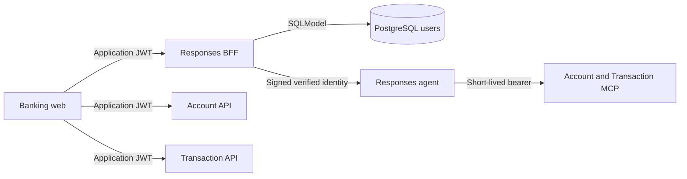

# Responses BFF

FastAPI browser trust boundary for the banking assistant. It has exactly two jobs:
authenticate PostgreSQL users and issue/verify the application JWT (`/auth/login`,
`/auth/me`), and front the Responses agent. The browser never receives Azure
credentials. It does not read account, card, or transaction data; the frontend calls
Account and Transaction directly, authenticated with the same application JWT.

## Request Flow



Account, card, Dashboard, and Analytics reads call the
[Account and Transaction REST APIs](../business-api/README.md) directly over CORS,
each verifying the same JWT independently in its own `jwt_identity.py`. Conversational
inquiries use the agent and MCP services instead, authenticated through a separate
short-lived internal bearer; neither path replaces the other's service-layer
ownership checks.

## HTTP Contract

| Method | Route         | Behavior                                                                                         |
| ------ | ------------- | ------------------------------------------------------------------------------------------------ |
| POST   | `/auth/login` | Verify persisted email and Argon2 password hash; return bearer token and user profile.           |
| GET    | `/auth/me`    | Return verified identity and persisted customer name. Requires bearer JWT.                       |
| POST   | `/responses`  | Proxy Responses events with verified identity and user-bound conversations. Requires bearer JWT. |

JWT identity includes `sub`, `customer_id`, `email`, and `locale`, with `iss`, `aud`,
`iat`, and `exp` metadata. The display `name` is profile response data, not a JWT claim.
Missing customer names return `null`. Account/card/transaction response shapes,
pagination, masking, and ownership rules are documented in the
[business-api README](../business-api/README.md) now that those reads live there
instead of in the BFF.

### Controlled Errors

Application-raised failures use `{"detail":{"code":"SERVICE_UNAVAILABLE"}}`
with an allow-listed code: `AUTH_REQUIRED`, `INVALID_CREDENTIALS`,
`SERVICE_UNAVAILABLE`, or `INVALID_REQUEST`. HTTP statuses and bearer challenges are
preserved. Framework validation responses can retain their standard shape; the
frontend treats unknown codes, raw details and non-JSON responses as safe local
fallbacks rather than displaying server text. Successful Responses streams are
unchanged.

## Local Development

Run from the repository root using the ignored root `.env.dev`:

```powershell
uv sync --project app/responses-bff
uv run --project app/responses-bff --env-file .env.dev uvicorn bff.main:app --app-dir app/responses-bff --port 8080
```

Set `PROFILE=dev`, `RESPONSES_UPSTREAM_MODE=local`, and
`RESPONSES_AGENT_ENDPOINT=http://127.0.0.1:8088/responses` in that environment.
The root `DEV - Full Stack Ordered` launch starts this service with the MCP services,
agent, and frontend. Restart the BFF after Python edits when running without `--reload`.

## Configuration

| Variable                   | Purpose / default                                                                                 |
| -------------------------- | ------------------------------------------------------------------------------------------------- |
| `DATABASE_URL`             | Shared SQLModel PostgreSQL connection URL; required for persisted login/profile reads.            |
| `JWT_SECRET_KEY`           | Application HS256 signing key, at least 32 characters.                                            |
| `JWT_ISSUER`               | `home-banking-api`                                                                                |
| `JWT_AUDIENCE`             | `home-banking-web`                                                                                |
| `JWT_ACCESS_TOKEN_MINUTES` | `15`; supported range `1` to `60`.                                                                |
| `INTERNAL_IDENTITY_SECRET` | Shared downstream identity signing secret, at least 32 characters.                                |
| `RESPONSES_UPSTREAM_MODE`  | `foundry` by default; use `local` for local browser validation.                                   |
| `RESPONSES_AGENT_ENDPOINT` | Local default `http://127.0.0.1:8088/responses`; configure the approved upstream for hosted mode. |
| `RESPONSES_TOKEN_SCOPE`    | `https://ai.azure.com/.default`                                                                   |
| `AZURE_CLIENT_ID`          | Optional client ID for server-side Azure credentials.                                             |
| `ALLOWED_ORIGINS`          | JSON array; defaults to `["http://localhost:5170"]`.                                              |

Keep secrets in ignored environment files or protected deployment settings. Never log
passwords, password hashes, JWTs, or Azure credentials. `AUTH_USERS` is not a login
source. Seed demo identities separately using the [data module guide](../business-api/data/README.md#seed-demo-users).
The shared models and session factory live in [banking-shared](../business-api/shared).

## Validation and Limits

```powershell
cd app/responses-bff
uv run python -m pytest tests -q
```

Tests cover persisted user-repository queries (`find_by_email`, `find_customer_name`),
authentication (`/auth/login`, `/auth/me`), and Responses proxy behavior. Account,
card, and transaction contract tests moved to the
[business-api suite](../business-api/README.md) along with the endpoints themselves.
The focused BFF suite passed with 34 tests after the direct-API migration.

The frontend keeps conversation IDs only in React state. A reload sends the next
message without `conversation`; the BFF creates a new opaque ID bound to verified
`sub`. Subsequent messages reuse it, and another user's ID is rejected. The local
agent persists workflow checkpoints through the SDK filesystem store, not this BFF
or PostgreSQL. See the [agent state guide](../agent/README.md#conversation-state).

Hosted identity transport and deployed parity still require separate validation.
Registration, password reset, MFA, revocation, and production identity lifecycle
controls are not implemented.

For zip packaging and dependency export, follow the
[root deployment artifact guide](../../README.md#python-dependency-artifact-for-app-service-zip-deploy).
