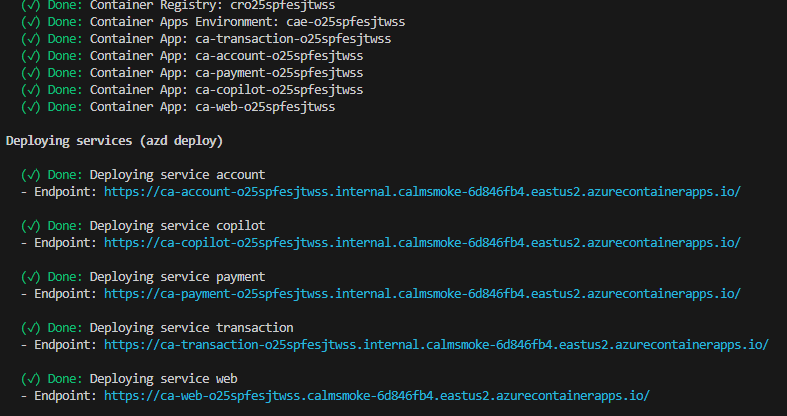

# Deployment Guide

> [!WARNING]
> Provisioning and hosted identity transport have not been verified end to end for the
> hackathon environment. Review the Terraform plan and existing resource ownership before
> running these commands. The root project targets App Service through Terraform; the
> hosted agent uses a separate azd project at `app/backend/azure.yaml`.

## **🚀 Quick Start**

You can clone this repo and change directory to the root of the repo. Or you can run `azd init -t Azure-Samples/agent-openai-python-banking-assistant`.

Once you have the project available locally, run the following commands if you don't have any pre-existing Azure services and want to start from a fresh deployment.

1. Run

   ```shell
   azd auth login
   ```

2. Run

   ```shell
   azd up
   ```

For the hosted-agent stack, run from repository root:

```shell
azd up --cwd app/backend
```

- Root `azd up` provisions the Terraform App Service stack and deploys its services.
- Backend `azd up --cwd app/backend` deploys the hosted workflow to an existing Foundry
  project. Its manifest declares `gpt-4.1-mini`, but does not create that model deployment.

3. After the application has been successfully deployed you will see a web app URL printed to the console. Click that URL to interact with the application in your browser.

It will look like the following:



### **Important: Note for PowerShell Users**

If you encounter issues running PowerShell scripts due to the policy of not being digitally signed, you can temporarily adjust the `ExecutionPolicy` by running the following command in an elevated PowerShell session:

```powershell
Set-ExecutionPolicy -Scope Process -ExecutionPolicy Bypass
```

This will allow the scripts to run for the current session without permanently changing your system's policy.

## 🛠️ Troubleshooting & Common Issues

**Before starting deployment**, be aware of these common issues and solutions:

| **Common Issue**                      | **Quick Solution**                             | **Full Guide Link**                                                             |
| ------------------------------------- | ---------------------------------------------- | ------------------------------------------------------------------------------- |
| **ReadOnlyDisabledSubscription**      | Check if you have an active subscription       | [Troubleshooting Guide](./troubleshooting.md#readonlydisabledsubscription)      |
| **InsufficientQuota**                 | Verify quota availability                      | [Quota Check Guide](./quota_check.md)                                           |
| **ResourceGroupNotFound**             | Create new environment with `azd env new`      | [Troubleshooting Guide](./troubleshooting.md#resourcegroupnotfound)             |
| **InvalidParameter (Workspace Name)** | Use compliant names (3-33 chars, alphanumeric) | [Troubleshooting Guide](./troubleshooting.md#workspace-name---invalidparameter) |
| **ResourceNameInvalid**               | Follow Azure naming conventions                | [Troubleshooting Guide](./troubleshooting.md#resourcenameinvalid)               |

> **If you encounter deployment errors:** Refer to the [complete troubleshooting guide](./troubleshooting.md) with comprehensive error solutions.

## Redeploying Infra or App Code Changes

If you've only changed the backend/frontend code in the `app` folder, then you don't need to re-provision the Azure resources. You can just run:

```shell
azd deploy
```

For hosted-agent code changes, use:

```shell
azd deploy --cwd app/backend
```

If you changed the root infrastructure files (`infra` or the root `azure.yaml`), review
the Terraform plan and then reprovision the App Service stack:

```shell
azd up
```

Do not use `azd down` as a rollback against an existing shared resource group. Inspect
the Terraform state and plan first.

## Model Configuration

Set `MODEL_DEPLOYMENT_NAME` in the backend azd environment to the name of an existing
deployment in the configured Foundry project. The checked-in manifest declares
`gpt-4.1-mini`; neither the root Terraform stack nor the backend manifest provisions it.
Changing the declaration does not create, resize, or validate model capacity.

## Running Agents locally

The supported local topology runs independently of App Service deployment. Use the root
VS Code launch `DEV - Full Stack Ordered`; for component details, see:

- the [backend README](../app/backend/README.md) to run the agents backend and the frontend
- the [business API README](../app/business-api/README.md) to run the simulated banking MCP servers.
