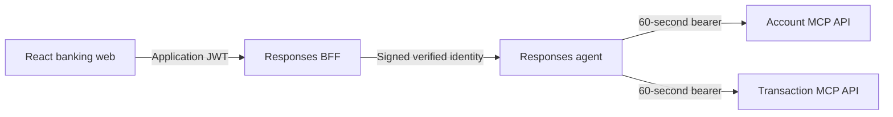
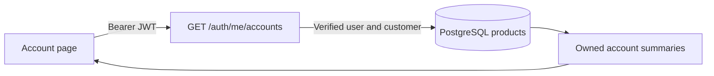

# Technical Architecture

The banking assistant uses a browser-facing Responses BFF and a separately deployed Microsoft Foundry agent. Account and Transaction are the only active specialist agents.

## Request Flow

The BFF is the browser trust boundary. It validates the application JWT, signs verified `sub` and `customer_id` claims, binds conversation identifiers to that user, and forwards Responses requests. The agent verifies the signed envelope and issues a fresh 60-second bearer for MCP calls. In hosted mode, the BFF also obtains an Azure access token server-side. The browser never receives a Foundry credential and cannot provide arbitrary downstream identity.

## Deployable Units

| Unit            | Location                                                            | Responsibility                                       |
| --------------- | ------------------------------------------------------------------- | ---------------------------------------------------- |
| Banking web     | [`app/frontend/banking-web`](../app/frontend/banking-web/README.md) | React UI and Responses SSE consumption               |
| Responses BFF   | [`app/responses-bff`](../app/responses-bff/README.md)               | Persisted login/profile/accounts and Responses proxy |
| Hosted agent    | [`app/agent`](../app/agent/README.md)                               | Account/Transaction handoff workflow                 |
| Account API     | [`app/business-api/account`](../app/business-api/account)           | Account MCP tools                                    |
| Transaction API | [`app/business-api/transaction`](../app/business-api/transaction)   | Transaction MCP tools                                |

The root Terraform stack provisions the web, BFF, Account, Transaction, and Payment App Services. Payment remains an infrastructure/business API artifact but is not connected to the active agent workflow. The hosted Foundry agent uses the independent [`app/agent/azure.yaml`](../app/agent/azure.yaml) project root.

## Local Topology

| Port   | Process               |
| ------ | --------------------- |
| `5170` | Banking web           |
| `8080` | Responses BFF         |
| `8088` | Local Responses agent |
| `8070` | Account MCP           |
| `8071` | Transaction MCP       |

The BFF uses its local upstream mode for browser validation. Hosted Foundry deployment is a separate later-stage target.

## Authentication Status

The BFF verifies PostgreSQL-backed Argon2 users and issues short-lived HS256 JWTs containing `sub`, `customer_id`, `email`, `locale`, `iss`, `aud`, and `exp`. Customer display names are returned through login and `/auth/me`, not added to JWT claims. Local browser validation has covered persisted login, customer-name display, account selection, user-bound conversations, foreign-account denial, and an authorized follow-up. Dynamic agent profile/locale injection and hosted identity transport remain separate pending work.

## Account Page Reads

The BFF joins persisted user/customer ownership and filters savings/checking products.
It returns a limited summary rather than a full database model. The frontend selects
one account at a time and displays stored fields only. This read path does not call the
agent or bypass the ownership checks used by conversational MCP inquiries.
