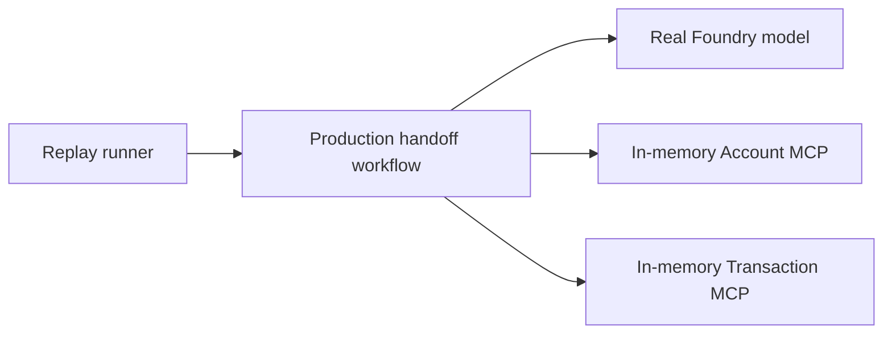

# Held-Out Evaluation: Transaction-Dispute Workflow

A fixed dispute scenario set, an offline policy baseline, and an isolated MCP
replay harness. These are evaluation building blocks, not evidence of a completed
transaction-dispute workflow evaluation.

## Coverage and Evidence

### Hackathon Baseline Requirement

The organizer brief requires baseline and proposed system to run on the same
held-out workload, including failures, case mix, label quality, model/prompt
versions, and repeated-run variability where relevant. It also requires evaluating
at least one learned component against an appropriate baseline; training a new
model is not mandatory. For this project, the pretrained agent's dispute intent,
tool selection, and workflow behavior are the learned-component evaluation target.

The current `run_baseline` is a policy simulation derived from each scenario's
`expected_outcome`, with safe denials inherited and unsafe outcomes set to false.
It is not an independently executed baseline and cannot establish measured safety,
latency, cost, or improvement over customer support. Implement and freeze an
executable, justified rules-based intake/routing comparator, with the same permitted
facts, business approval constraints, fixtures, workload, and outcome checks as the
proposed agent. A same-model ablation is a separate optional diagnostic, not a
replacement for the main workflow comparison.

The fraud-score threshold analysis is separate policy/signal evidence. Its tuned
in-sample figures do not by themselves prove a held-out learned-component baseline
comparison or improved dispute resolution. Do not change production triage policy
to satisfy this evaluation requirement.

| Surface                                                                        | Existing coverage                                                                         | What it does not establish                                                        |
| ------------------------------------------------------------------------------ | ----------------------------------------------------------------------------------------- | --------------------------------------------------------------------------------- |
| [Service tests](../app/business-api/transaction/tests/test_dispute_service.py) | Deterministic seeded-fixture checks for lifecycle, triage, ownership, and recommendations | Real-model behavior or deployed PostgreSQL parity                                 |
| [MCP replay cases](replay_cases.json)                                          | Three Account/Transaction smoke cases: balance, denial, and empty transactions            | Dispute intake, approval, escalation, or resolution                               |
| [Held-out scenarios](scenarios.json)                                           | 18 dispute-focused scenario definitions across six categories                             | Executed proposed-system results or observed state transitions                    |
| [Held-out runner](run_held_out_eval.py)                                        | Offline policy baseline and live-response collection                                      | Automatic verification of persisted states, approval events, or tool trajectories |

The next quality priority is dispute-specific replay using the real workflow and
model, with automatic checks over tool arguments, per-turn outputs, and approval
boundaries. Real service authorization, persistence, and hosted continuation stay
in a separate integration lane. No complete proposed-system dispute evaluation is
verified yet.

The reporting targets are Safe Automated Resolution, Containment, Escalation
Quality, Unsafe Outcomes, and Operating Efficiency. The current runner calculates
outcome metrics from policy labels or final-text heuristics; latency is collected
for live runs. Model cost and verified workflow-state metrics remain pending.

## Files

- [`scenarios.json`](scenarios.json): 18 fixed cases (3 per category) across six
  categories: normal resolution, ambiguous/unsupported, human-required,
  adversarial, multilingual ambiguity, and workflow progression.
- [`run_held_out_eval.py`](run_held_out_eval.py): computes the baseline offline (no
  running services needed) and, when the local stack is up, sends proposed-system
  turns through the Responses BFF. Hosted mode is an unverified direct diagnostic
  path, not evidence of browser-to-BFF end-to-end behavior.

## Isolated MCP Replay

[`mcp_replay.py`](mcp_replay.py) runs separate Account and Transaction MCP servers
over SDK memory sessions. [`run_mcp_replay.py`](run_mcp_replay.py) injects those
sessions into the existing workflow and uses a real Foundry model. No business
API, BFF, database, production identity secret, or application JWT is required.
Model access still requires Azure authentication and incurs model usage.
Production callers keep their HTTP transports and authentication unchanged.



Run the offline protocol checks from the repository root:

```powershell
uv run --project app/agent python -m pytest app/agent/tests/test_mcp_replay.py -q
```

For an explicitly requested model run, use an existing Azure CLI login with model
access and supply the project endpoint and deployment name:

```powershell
uv run --project app/agent python evals/run_mcp_replay.py --project-endpoint https://ACCOUNT.services.ai.azure.com/api/projects/PROJECT --model gpt-4.1-mini
```

`--case REPLAY-ACCOUNT-1` selects one case; repeat it for multiple cases.
`--timeout-seconds` defaults to 120 per case. `--output` defaults to the ignored
`evals/results/mcp-replay.json`; subsequent runs overwrite that path unless a
different output is supplied. The CLI does not start services or create Foundry
evaluations/runs. Its Azure credential is model-only; the workflow receives a
synthetic signed identity and an isolated synthetic signing secret.

[`replay_cases.json`](replay_cases.json) contains three synthetic cases: a balance
lookup, an ownership-denial response, and an empty transaction lookup. These are
not the 18 real-data held-out cases. The recorder stores the complete SDK response,
final answer, ordered cross-server calls, fixture failures, unused replies, and
nested error causes. Unexpected calls or unused replies fail the protocol check;
an empty answer or a lifecycle error also fails. `protocol_passed` does not grade
grounding, locale, or business behavior: compare the complete transcript with
`expected_behavior` before marking `behavior_review` complete.

Tool names/descriptions and supported string/boolean schemas are derived from
production declarations without importing database services. This is not yet an
independent comparison against the deployed FastMCP `tools/list` response, and
fixture outputs are synthetic rather than validated database records. Model
routing can vary; exact expected call sequences intentionally expose deviations.

Every report carries `offline_or_simulated: true`, even when model execution is
real. A canned ownership denial tests the model's reaction, not service-layer
authorization. Keep real BFF/identity, PostgreSQL parity, dispute policy, and
hosted end-to-end verification in a separate integration/authz lane.

### Foundry Display Names

Use the reference repository's agent-first display-name convention:

- Evaluation: `<agent-id>-<lane>-eval`.
- Run: `<evaluation-name> run`.

The reference trace lane uses `<agent-name>:<version>-trace-eval`. Replay uses
`home-banking-agent-mcp-replay-eval` because it constructs the local workflow,
not a deployed agent version. These are display names, not service-generated IDs.
The local report records both names but remains `foundry_submission: not_submitted`.
Existing remote objects and the native azd evaluation recipe are unchanged.

### Verification Status

Eight offline replay tests passed in the implementation session. The CLI help
path was checked without model authentication. A real-model replay run and manual
behavioral review remain pending; offline tests do not establish measured agent
quality. PR execution of real-model replay is not yet configured in this repo.

## Held-Out Status

- **Baseline (offline, reproducible now):**

  ```powershell
  python evals/run_held_out_eval.py --system baseline
  ```

  Sample size 18, fully offline. Result as of 2026-10-01: Safe Automated Resolution
  0.0 (the baseline never fast-tracks by design), Containment 0.667, Escalation
  Quality 1.0, Unsafe Outcomes 0/18. This is a "triage disabled" policy: every
  dispute either asks a clarifying question or escalates to the simulated human
  reviewer; security/ownership denials and pre-check rejections are unaffected
  because they sit outside the triage policy.

- **Proposed system (not yet run):** requires the full local stack (Account,
  Transaction, agent, BFF) already running, which this script does not start itself.
  Run it with:

  ```powershell
  python evals/run_held_out_eval.py --system proposed --bff-base-url http://localhost:8080
  ```

  Real-data scenarios tagged `requires_dispute_window_fix: true` are blocked at the dispute-window
  pre-check regardless of agent behavior, because the loaded cohort's most recent
  transaction is already outside the live `DISPUTE_WINDOW_DAYS=90` check against the
  real clock. That is an expected, documented rejection, not an evaluation harness
  bug.

- **Classification caveat:** `_classify_response` in `run_held_out_eval.py` is a
  keyword heuristic over only the last turn's final text, not a judge model or a
  state-machine assertion. The runner retains only a 200-character snippet in
  `detail`, not complete per-turn transcripts. It does not query persisted cases
  or timelines. Expected status paths in the dataset are not observed transitions;
  full transcript capture and independent state checks are required before citing
  workflow-success numbers.

## Labeling discipline

Every number this script prints carries `sample_size` and `offline_or_simulated`.
Never present the baseline numbers above as a measured production result, and never
report proposed-system workflow numbers without executing the intended path,
retaining complete transcripts, and verifying the expected service outcomes.
Containment is not equivalent to resolution. The offline policy baseline is not a
measured human-support operation; transaction activity does not establish dispute
volume, support costs, or economic savings. Any business-impact estimate must state
its assumptions separately from measured evaluation results.

## Against the deployed hosted agent (`home-banking-agent`)

A hosted deployment was confirmed in an earlier session, but deployment success
does not prove identity transport, multi-turn continuation, or dispute correctness.
The following records describe two attempted evaluation paths, not current verified
quality results:

- **Native (`azd ai agent eval`)**: blocked even for identity-independent prompts.
  Tried against `app/agent/datasets/held-out-identity-independent.jsonl`
  (the three `ambiguous_unsupported` cases, `AU-1`/`AU-2`/`AU-3`) via
  `azd ai agent eval generate --agent home-banking-agent --dataset datasets/held-out-identity-independent.jsonl ...`
  then `azd ai agent eval run` (the recipe and hand-written dataset live under
  `app/agent/eval.yaml` and `app/agent/datasets/`; generated evaluators and
  `.agent_configs/` are gitignored and must not be committed). Result: **3 total, 0 passed, 0 failed,
  3 errored**. Root cause: every agent turn (not just tool calls) runs through
  `UserProfileProvider`, which calls `get_internal_principal()` unconditionally; with no
  `x-ms-user-identity` header, that raises before the agent produces any response.
  `azd ai agent invoke`/`eval` has no flag to inject a custom header (only
  `--user-isolation-key`/`--chat-isolation-key`, a different Foundry feature our agent
  doesn't use), so this errors on _every_ scenario, not just ones needing real customer
  data. Open the `Report:` URL the command prints for the raw per-row error if you want
  to confirm this directly in the portal.
- **Custom (`--target hosted`)**: `run_held_out_eval.py --system proposed --target hosted`
  bypasses the azd invoke path entirely and calls the deployed agent's `/responses`
  endpoint directly, self-minting the same `x-ms-user-identity` envelope the BFF would
  (`_sign_internal_identity`, mirroring `app/responses-bff/bff/internal_identity.py`
  exactly) and fetching an AAD token via the already-logged-in `az` CLI
  (`https://ai.azure.com` resource). This is an implemented attempt, not a verified
  unblock: the signed hosted smoke returned HTTP 403 before the agent handler.
  Hosted platform identity permissions and envelope compatibility remain unresolved.

  Requires `INTERNAL_IDENTITY_SECRET` (the same value `cd-hosted-agent.yaml` deployed)
  in your shell environment and an `az login` session with access to the
  `foundry-development` project. **Set the secret yourself and run this directly in
  your own terminal** — never paste it into chat or a shared terminal session:

  ```powershell
  $env:INTERNAL_IDENTITY_SECRET = "<value>"
  python evals/run_held_out_eval.py --system proposed --target hosted --only-category ambiguous_unsupported
  ```

  Secret parity alone does not establish hosted identity transport or clear the
  independent database-migration gate. Once hosted identity is verified, the
  scenario data dependencies are:
  - **Clean, no DB dependency (5):** `AU-1`/`AU-2`/`AU-3` (no tool call needed at all)
    and `ML-2`/`ML-3` (response locale comes from the self-minted envelope's `locale`
    claim, never a DB lookup). These still require a successful hosted turn before
    their results can be cited.
  - **Runs, but weak evidence until the DB has real data (3):** `AD-1`/`AD-2`/`AD-3`.
    With an empty deployed Postgres, any cross-customer lookup returns "not found"
    regardless of ownership enforcement, so a "denied" result here doesn't yet prove
    IDOR protection against a resource that actually exists for another customer.
  - **Still blocked either way (10):** `NR-1`/`NR-2`/`NR-3`, `HR-1`/`HR-2`/`HR-3`,
    `ML-1`, `WP-1`/`WP-2`/`WP-3` — all need a real, persisted transaction/product/
    customer row the agent can actually find and act on.

  `WP-*` also has a second, independent caveat: multi-turn continuation against the
  hosted endpoint is best-effort (it reuses whatever `conversation` value the response
  body returns, if any) and hasn't been validated yet.
